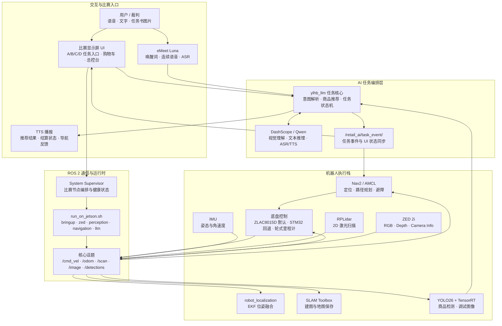

<div align="center">

# 🤖 YLHB Smart Retail Robot

### ROS 2 + Jetson Orin Nano Super 驱动的多模态智慧零售机器人

**一台会听、会看、会推荐、会导航的比赛级智能零售机器人。**

面向智慧零售竞赛场景，完整打通 **ZLAC8015D 底盘控制 / SLAM 建图 / Nav2 导航 / ZED 2i 视觉 / YOLO 商品识别 / 大模型任务理解 / 连续语音交互 / 现场 UI 总控台**。

<p>
  
  
  
  
  
  
  
  
  
</p>

<p>
  <strong>比赛主线：</strong>
  语音/文字任务理解 -> 货架导航 -> 商品识别 -> 推荐与确认 -> 取货/结算 -> 返回起点
</p>

<p>
  <a href="#-快速开始">快速开始</a> ·
  <a href="#-常用启动命令">启动命令</a> ·
  <a href="#-比赛任务流程">比赛任务</a> ·
  <a href="#-系统架构">系统架构</a> ·
  <a href="src/PROJECT_DOC_zh.md">详细文档</a>
</p>

```bash
./scripts/setup_zlac_can.sh can0 500000
./scripts/run_on_jetson.sh competition
```

</div>

---

## 🎯 项目定位

这个仓库是一个面向 Jetson 本机部署的 ROS 2 工作区源码仓库，不是单节点 demo。它把底盘、传感器、导航、视觉检测、大模型任务理解、连续语音和比赛 UI 组织成一套可现场运行的机器人系统。

默认底盘后端是 **ZLAC8015D V4 + SocketCAN/CANopen**；保留 STM32 串口后端作为回退方案。比赛现场推荐从 `./scripts/run_on_jetson.sh competition` 进入，由 UI 和 system supervisor 编排底层、视觉、导航和 AI 节点。

## ✨ 项目亮点

| 方向 | 能力 |
|---|---|
| 🚗 机器人底盘 | ZLAC8015D SocketCAN 默认后端、STM32 串口回退、IMU 驱动、RPLidar 雷达、URDF 模型、EKF 融合 |
| 🗺️ 建图与导航 | SLAM Toolbox 建图、AMCL 定位、Nav2 自主导航、地图保存与加载 |
| 👁️ 视觉感知 | ZED 2i 图像订阅、YOLO26 商品检测、TensorRT 推理、检测结果发布 |
| 🧠 多模态 AI | DashScope/Qwen 图片理解、文字/语音任务解析、商品推荐、结算播报 |
| 🎙️ 连续语音 | eMeet Luna 麦克风输入、唤醒词连续语音会话、ASR 事件路由、TTS 播报 |
| 🖥️ 比赛 UI | A/B/C/D 任务入口、B-1 图片预览、识别结果、购物车、总价、系统总控台 |

> 本仓库不提交 `build/`、`install/`、`log/`、API Key 和模型二进制文件。克隆后需要在目标 Jetson 上本机构建。

---

## 🧭 系统架构



---

## 📦 目录结构

```text
.
├── scripts/
│   ├── install_jetson_dependencies.sh   # Jetson 依赖安装
│   ├── build_on_jetson.sh               # 本机构建入口
│   ├── setup_zlac_can.sh                # ZLAC8015D SocketCAN 配置
│   └── run_on_jetson.sh                 # 现场运行入口
├── src/
│   ├── ylhb_base/                       # 底盘、IMU、URDF、EKF、SLAM、Nav2
│   ├── ylhb_perception/                 # ZED、YOLO/TensorRT、深度定位
│   ├── ylhb_llm/                        # 大模型任务层、语音、TTS、比赛 UI
│   ├── ylhb_interfaces/                 # 自定义 ROS 2 消息
│   ├── rplidar_ros-ros2/                # RPLidar ROS 2 驱动源码
│   ├── zed-ros2-wrapper/                # ZED ROS 2 wrapper 源码
│   ├── PROJECT_DOC_zh.md                # 详细中文开发与比赛调试文档
│   ├── my_map.yaml
│   └── my_map.pgm
├── MIGRATION_JETSON.md                  # Jetson 本机化迁移说明
└── SECURITY.md                          # 安全与密钥规范
```

---

## 🧩 硬件与软件环境

### 硬件组成

| 模块 | 设备 | 用途 |
|---|---|---|
| 主控 | Jetson Orin Nano Super | 运行 ROS 2、Nav2、感知节点、AI 任务层和显示屏 UI |
| 底盘控制 | ZLAC8015D V4 双轮毂伺服驱动器 | 默认后端；通过 SocketCAN/CANopen 接收 `/cmd_vel`，发布 `/odom`、`/zlac8015d/status`、`/zlac8015d/fault` |
| 底盘回退 | STM32 大脑底板 | 串口回退后端；用于旧底盘链路调试和备用运行 |
| 雷达 | RPLidar | 发布 `/scan`，用于 SLAM、AMCL 定位和 Nav2 避障 |
| 相机 | ZED 2i | 发布 RGB 图、深度图和相机内参，供 YOLO 和 3D 粗定位使用 |
| IMU | 底盘 IMU | 与轮式里程计进入 EKF，提高短时位姿稳定性 |
| 语音 | eMeet Luna | 麦克风输入、TTS 播放；推荐录音设备 `plughw:CARD=Luna,DEV=0` |
| 显示 | Jetson 本机 HDMI / 触摸屏 | 比赛 UI、任务 D 驾驶舱和现场总控台 |

### 软件栈

| 类型 | 组件 |
|---|---|
| 系统 | Ubuntu 22.04 / ROS 2 Humble |
| 导航 | SLAM Toolbox、Nav2、AMCL、robot_localization |
| 视觉 | ZED ROS 2 wrapper、OpenCV、CUDA、TensorRT、YOLO26 |
| AI | DashScope OpenAI 兼容接口、Qwen 视觉/文本/ASR/TTS 模型 |
| UI | PyQt 比赛显示屏总控台 |

---

## 🚀 快速开始

默认工作区路径是 `~/ros2_ws`。如果克隆到其他目录，请先设置：

```bash
export WS_DIR=/path/to/ros2_ws
```

在 Jetson 上克隆仓库：

```bash
cd ~
git clone https://github.com/liaojingwu20041031/ylhb-smart-retail-robot.git ros2_ws
cd ~/ros2_ws
```

安装依赖并构建：

```bash
./scripts/install_jetson_dependencies.sh
./scripts/build_on_jetson.sh
```

`scripts/run_on_jetson.sh` 会自动加载 `/opt/ros/$ROS_DISTRO/setup.bash` 和 `install/setup.bash`，日常启动不需要手动 `source`。

自研包验证命令：

```bash
PYTHONNOUSERSITE=1 colcon test \
  --packages-select ylhb_base ylhb_perception ylhb_llm ylhb_interfaces \
  --event-handlers console_direct+
```

> 仓库包含 ZED/RPLidar 第三方源码。第三方包用于部署构建，默认不把 vendor lint 作为项目质量门槛；完整 `colcon test` 可能因第三方包格式规则或离线 schema 校验失败。

---

## 🕹️ 常用启动命令

`scripts/run_on_jetson.sh` 是 Jetson 现场推荐入口，支持以下模式：

```text
bringup       启动底盘、IMU、雷达、URDF、EKF
mapping       启动 SLAM Toolbox 建图
navigation    启动 Nav2，默认地图为 ~/ros2_ws/src/my_map.yaml
zed           启动 ZED 2i wrapper
perception    启动 TensorRT YOLO 感知节点
llm           启动 AI 任务层、语音节点和可选 UI
competition   启动比赛显示屏 UI、system supervisor 和内嵌 AI 任务层
teleop        启动键盘遥控
```

### 比赛现场一键入口

```bash
./scripts/run_on_jetson.sh competition
```

`competition` 默认启动显示屏 UI、系统 supervisor、AI 任务层、连续语音会话和 TTS 播报。进入 UI 的“系统控制”页后，点击“一键启动比赛节点”，supervisor 会按：

```text
bringup -> zed -> perception -> navigation -> llm
```

顺序启动比赛栈。其中 AI 任务层已随 `competition` 内嵌运行，状态会显示为 `embedded`，不会重复启动。

默认参数：

```text
enable_voice:=true
enable_voice_session:=true
enable_capture_voice:=false
enable_tts:=true
audio_input_device:=plughw:CARD=Luna,DEV=0
audio_output_device:=default
tts_voice:=Serena
```

现场临时静音：

```bash
./scripts/run_on_jetson.sh competition enable_tts:=false
```

远程 X11 调试窗口模式：

```bash
./scripts/run_on_jetson.sh competition force_local_display:=false fullscreen:=false
```

### 单模块调试

```bash
# 底盘、IMU、雷达、URDF 和 EKF
./scripts/setup_zlac_can.sh can0 500000
./scripts/run_on_jetson.sh bringup

# STM32 串口回退底盘
./scripts/run_on_jetson.sh bringup base_backend:=stm32

# ZED 2i
./scripts/run_on_jetson.sh zed

# 大模型任务层，无语音无 TTS
export DASHSCOPE_API_KEY=你的DashScopeKey
./scripts/run_on_jetson.sh llm enable_voice:=false enable_tts:=false
```

启动视觉检测：

```bash
./scripts/run_on_jetson.sh perception \
  model_path:=/home/nvidia/ros2_ws/src/ylhb_perception/models/yolo26.engine \
  backend:=tensorrt \
  imgsz:=960 \
  confidence_threshold:=0.35 \
  max_det:=20 \
  half:=true \
  publish_debug_image:=false \
  log_interval_sec:=2.0 \
  device:=cuda:0
```

---

## 🎙️ 语音交互

项目推荐使用唤醒式连续语音模式。UI 中点击“开启语音模式”后，机器人本地监听人声；听到“小零小零”“小玲小玲”等唤醒词后进入会话。

接入 eMeet Luna 后，先确认系统能看到声卡：

```bash
lsusb | grep -i emeet
arecord -l
aplay -l
```

启动连续语音和 TTS：

```bash
export DASHSCOPE_API_KEY=你的DashScopeKey
./scripts/run_on_jetson.sh llm \
  enable_voice:=true \
  enable_voice_session:=true \
  enable_tts:=true \
  audio_input_device:=plughw:CARD=Luna,DEV=0 \
  audio_output_device:=plughw:CARD=Luna,DEV=0 \
  tts_voice:=Serena
```

连续语音服务和调试话题：

```bash
ros2 service call /retail_ai/start_voice_session std_srvs/srv/Trigger "{}"
ros2 service call /retail_ai/stop_voice_session std_srvs/srv/Trigger "{}"
ros2 topic echo /retail_ai/voice_session_status
ros2 topic echo /retail_ai/voice_command_event
```

---

## 🏁 比赛任务流程

项目按比赛任务 A/B/C/D 组织运行：

| 任务 | 流程 |
|---|---|
| A | 语音、文字或键盘命令转换为 `/cmd_vel`，完成前进、后退、转向、停止等基础动作 |
| B-1 | 导入任务书图片，大模型理解任务，导航到货架 A，识别真实商品，推荐商品，抓取后前往结算区 B |
| B-2 | 接收购物需求或商品指令，大模型像销售员一样给出主推和备选商品；用户确认后才发布取货事件 |
| C | 识别结算区商品，播报商品清单，根据 `products.yaml` 计算总价并返回起点 S |
| D | 通过现场显示屏 UI 展示任务状态、识别结果、播报文本、购物车和结算信息 |

任务书图片分析服务：

```bash
# 图片放在 /home/nvidia/ros2_ws/src/ylhb_llm/test_images
# 目录内只保留一张 .jpg/.jpeg/.png
ros2 service call /retail_ai/start_b1_task std_srvs/srv/Trigger "{}"
```

主要 AI/语音/UI 话题和服务：

```text
/retail_ai/task_event              # TaskEvent，inspect_shelf_for_recommendation / pick_item / checkout / return_start
/retail_ai/task_status             # TaskStatus，执行层回传 started/succeeded/failed/rejected
/retail_ai/sales_dialogue_status   # B-2 销售对话状态 JSON
/retail_ai/voice_command_event     # 连续语音 ASR 事件 JSON
/retail_ai/voice_session_status    # 连续语音会话状态 JSON
/retail_ai/capture_voice           # 单次录音 ASR service，competition 默认关闭
/retail_ai/start_voice_session     # 开启连续语音 service
/retail_ai/stop_voice_session      # 关闭连续语音 service
```

文字入口：

```bash
ros2 topic pub --once /retail_ai/text_command std_msgs/msg/String "{data: '来瓶可乐'}"
ros2 topic pub --once /retail_ai/text_command std_msgs/msg/String "{data: '我口渴了'}"
ros2 topic pub --once /retail_ai/text_command std_msgs/msg/String "{data: '确认'}"
ros2 topic echo /retail_ai/task_event
ros2 topic echo /retail_ai/sales_dialogue_status
ros2 topic echo /retail_ai/say_text
```

---

## 🗺️ 建图与导航

启动建图：

```bash
./scripts/run_on_jetson.sh mapping
```

启动导航：

```bash
./scripts/run_on_jetson.sh navigation
```

默认导航地图：

```text
~/ros2_ws/src/my_map.yaml
```

UI 的“保存地图”默认写入：

```text
~/ros2_ws/src/maps/<map_name>.yaml/.pgm
```

导航默认仍读取 `~/ros2_ws/src/my_map.yaml`。要使用新保存的地图，需要复制成默认地图或启动导航时覆盖 `map:=...`。

---

## 🧠 模型文件说明

模型二进制文件不提交到 GitHub。需要在 Jetson 上准备：

```text
/home/nvidia/ros2_ws/src/ylhb_perception/models/yolo26.onnx
/home/nvidia/ros2_ws/src/ylhb_perception/models/yolo26.engine
```

PC 端导出 ONNX 后，将 `yolo26.onnx` 放入 `src/ylhb_perception/models/`，再在 Jetson 上编译 TensorRT engine：

```bash
ros2 run ylhb_perception export_yolo_trt.py \
  --onnx /home/nvidia/ros2_ws/src/ylhb_perception/models/yolo26.onnx \
  --output /home/nvidia/ros2_ws/src/ylhb_perception/models/yolo26.engine \
  --workspace 2048
```

DashScope API Key 不写入代码。运行图片理解、云端 ASR 或云端 TTS 前，在终端设置：

```bash
export DASHSCOPE_API_KEY=你的DashScopeKey
```

## 🧪 适合谁参考？

- 正在做 ROS 2 智能车、移动机器人或比赛项目的同学
- 想把 Jetson、ZED、Nav2、YOLO、LLM 接成完整系统的开发者
- 需要智慧零售、服务机器人、多模态交互参考架构的团队
- 想学习“比赛工程如何从 demo 变成交付系统”的机器人爱好者

---

## 📌 Roadmap

- [x] Jetson 本机化部署
- [x] Nav2 / SLAM / EKF 基础运动栈
- [x] ZED 2i + YOLO26 + TensorRT 感知链路
- [x] DashScope/Qwen 多模态任务理解
- [x] 唤醒式连续语音会话
- [x] 比赛显示屏 UI 与 system supervisor
- [ ] 补充高质量演示 GIF、系统截图和视频链接
- [ ] 补充英文 README
- [ ] 增加 CI 检查自研 ROS 2 包
- [ ] 整理可复用的机器人任务编排框架

---

## 🔒 安全与规范

- 不提交 `DASHSCOPE_API_KEY`、`.env`、SSH key、证书或其他本机密钥。
- 不提交 `.onnx`、`.engine`、`.pt` 等模型二进制文件。
- 串口权限优先使用 udev 规则或用户组，不建议长期使用 `chmod 777`。
- 安全和部署注意事项见 [SECURITY.md](SECURITY.md)。

---

## 📚 详细文档

- [src/PROJECT_DOC_zh.md](src/PROJECT_DOC_zh.md)：比赛调试顺序、节点关系、话题流向、启动命令和常见问题。
- [MIGRATION_JETSON.md](MIGRATION_JETSON.md)：从旧 PC 推流识别流程迁移到 Jetson 本机开发、本机构建、本机运行。

---

## ⭐ 支持项目

如果这个项目对你做 ROS 2、Jetson、机器人比赛或多模态 AI Agent 有帮助，欢迎点一个 **Star**。  
后续会继续补充演示视频、部署文档和比赛实战记录。

<div align="center">

**YLHB Smart Retail Robot — 让机器人从“能跑”走向“能听懂、看懂、会执行”。**

</div>
