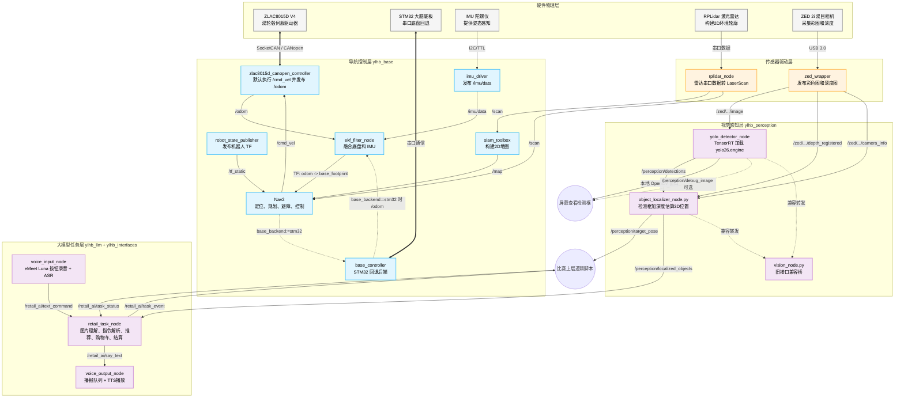
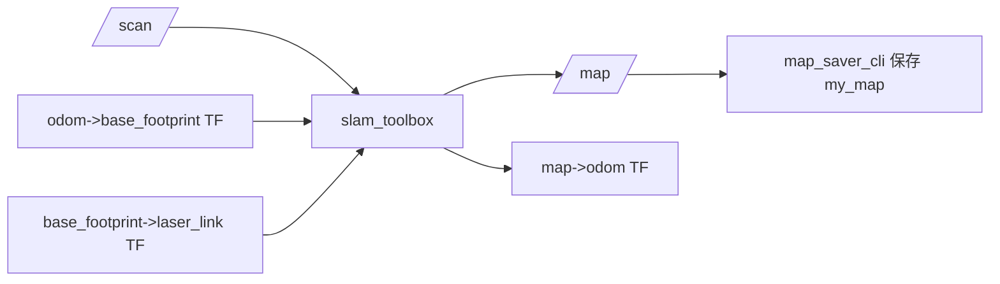
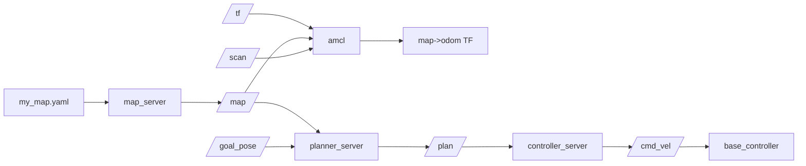
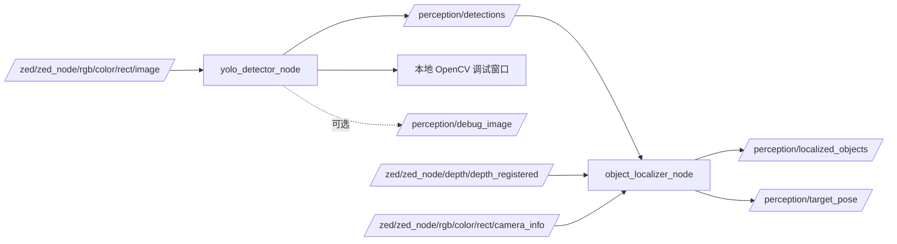

# ROS2 智能车比赛项目开发文档

平台：Jetson Orin Nano Super  
工作区：`~/ros2_ws`  
核心任务：**建图、导航、AI 识别**

本文档按比赛调试顺序编写，重点说明每个模块的技术原理、节点关系、话题流向、启动命令、验收标准和常见问题。

---

## 0. 比赛主流程

比赛准备和调试时，不要从单个脚本开始理解项目，先看主流程：

```text
1. 底层启动
   ZLAC8015D SocketCAN 底盘后端（默认）或 STM32 串口回退 + IMU + 雷达 + URDF + EKF

2. 建图
   RPLidar + 里程计 + TF -> SLAM Toolbox -> 保存 my_map.yaml / my_map.pgm

3. 导航
   已知地图 + AMCL 定位 + Nav2 规划控制 -> /cmd_vel -> 底盘运动

4. AI 识别
   ZED 2i 图像 -> YOLO26 -> 检测结果 / 本地窗口调试 / 深度定位

5. 比赛整合
   大模型任务层 -> 图片理解 / 语音文字指令解析 / 商品推荐 / 结算流程 -> 导航抓取任务事件
```

当前比赛任务流程按 A/B/C 三类处理：

```text
任务 A-1：
键盘或语音/文字发布前进、后退、左转、右转、停止 -> /cmd_vel -> 底盘动作。
规则没有要求每个基本动作都 AI 播报，所以项目不把“好的，开始前进”写成固定播报。

任务 A-2：
语音交互内容以现场任务书为准，不提前写死台词。语音经 ASR 进入 /retail_ai/text_command。

任务 B-1：
导入任务书图片 -> 大模型理解图片并播报理解内容 -> 发布“去货架 A 识别”事件
-> 到 A 区后识别货架真实商品 -> 从真实货架商品中推荐 1 个最佳商品并播报
-> 抓取推荐商品 -> 导航到结算区 B -> 放置商品。

任务 B-2：
接收文字或语音购物指令 -> 识别目标商品 -> 播报相应信息
-> 导航到货架 A -> 识别货架真实商品 -> 抓取目标商品
-> 导航到结算区 B -> 放置商品 -> 返回起点 S。

任务 C：
接收结算指令 -> 导航到结算区 B -> 识别结算区内所有商品
-> 播报商品清单 -> 返回起点 S -> 按 products.yaml 价格表计算并播报总价。
```

推荐启动顺序：

> **🚗 核心指令：启动底层系统 (Bringup)**

```bash
# 终端 1：启动底盘、IMU、雷达、URDF、EKF
# 进入工作目录并加载环境变量
cd ~/ros2_ws
source /opt/ros/humble/setup.bash
source install/setup.bash
# 一键启动底盘、IMU、雷达、URDF、EKF。IMU 默认必启，缺失会直接报错退出。
ros2 launch ylhb_base bringup.launch.py

# 无 USB-CAN 线或需要回退旧底盘板时：
ros2 launch ylhb_base bringup.launch.py base_backend:=stm32
```

### 底层串口约定与验收

Jetson Orin Nano Super 当前硬件连接约定：

```text
10c4:ea60 Silicon Labs CP210x  -> RPLidar A2M8
1a86:7523 QinHeng CH340        -> IMU 的 USB 转 TTL 模块
0c72:000c PEAK PCAN-USB        -> ZLAC8015D CANopen 底盘
```

比赛机上不要手动 `insmod pcan.ko`、手动运行 `setup_zlac_can.sh`，也不要在每次启动时临时传 `lidar_port:=...`。统一执行一次：

```bash
sudo ./src/bind_usb.sh
```

该脚本会安装并启用 `robot-hardware-guard.service`，循环恢复以下状态：

```text
/dev/robot_lidar -> ttyUSBx       # CP2102 LiDAR，驱动 cp210x
/dev/robot_imu   -> ttyCH341USBx  # CH340 IMU，驱动 usb_ch341
can1             -> PEAK PCAN-USB # 500000 bit/s, berr-reporting on, restart-ms 100, UP
```

安装验收：

```bash
systemctl status robot-hardware-guard.service --no-pager
tail -n 120 /var/log/robot-hardware-guard.log
lsusb -t
ls -l /dev/robot_lidar /dev/robot_imu /dev/ttyUSB* /dev/ttyCH341USB*
ip -details link show can1
```

期望结果：

```text
10c4:ea60 -> Driver=cp210x
1a86:7523 -> Driver=usb_ch341
0c72:000c -> Driver=pcan
/dev/robot_lidar -> ttyUSB0 或其他 ttyUSBx
/dev/robot_imu -> ttyCH341USB0 或其他 ttyCH341USBx
can1 state UP, bitrate 500000, ERROR-ACTIVE
```

`bringup.launch.py` 中 LiDAR 默认使用 `/dev/robot_lidar`。如果 alias 短暂不存在，launch 会按 USB ID `10c4:ea60` 自动查找 CP2102 的 `/dev/ttyUSB*` 作为回退；硬件修复仍然交给 `robot-hardware-guard.service`，ROS launch 只负责检测和报错。

RPLidar A2M8 固定按 `115200` 启动，launch 中将 `lidar_baudrate` 强制作为 int 传给 `rplidar_node`，避免参数类型错误导致节点回退到源码默认的 `1000000` 波特率。正常启动时必须看到类似日志：

```text
RPLidar serial config: port=... baudrate=115200 frame_id=laser_link
RPLidar S/N: ...
RPLidar health status : OK.
current scan mode: Sensitivity ... scan frequency:10.0 Hz
```

雷达验收：

```bash
ros2 topic echo /scan --once
```

如果雷达再次出现 `SL_RESULT_OPERATION_TIMEOUT`，先看日志中的 `RPLidar serial config`，确认端口是 `/dev/robot_lidar` 或 CP2102 回退端口且 `baudrate=115200`；不要再把 CH340 当成雷达端口排查。

IMU 当前注意事项：CH340 能出现在 `lsusb` 里只表示 USB 枚举成功，不等于 Linux 已经创建 tty 串口。当前 Jetson 内核配置为 `# CONFIG_USB_SERIAL_CH341 is not set` 时，`1a86:7523` 不会生成 `/dev/ttyUSB*`。本仓库使用 WCH `usb_ch341` 驱动，正常设备名是 `/dev/ttyCH341USB*`，稳定别名是 `/dev/robot_imu`。标准修复顺序：

```bash
./scripts/install_ch341_safe.sh --precheck
./scripts/install_ch341_safe.sh --test-load
sudo ./src/bind_usb.sh
ls -l /dev/robot_imu /dev/ttyCH341USB* /dev/ttyUSB*
ros2 launch ylhb_base bringup.launch.py
```

当前 IMU 实测为 WIT 协议 `9600` 波特率。`imu_driver` 默认 `baud_rate:=9600`，并保留自动探测常见波特率能力；默认不在每次启动时改写 IMU 模块配置，避免现场设备参数被反复写入。

IMU 验收命令：

```bash
lsmod | grep -E 'ch341|ch34x'
lsusb
dmesg | grep -i ch34
ls -l /dev/robot_imu /dev/ttyCH341USB* /dev/ttyUSB*
ros2 topic echo /imu/data --once
```

> **📷 核心指令：启动 ZED 2i 相机节点**

```bash
# 终端 2：启动 ZED 2i 相机
cd ~/ros2_ws
source install/setup.bash
# 参数详解：
#   camera_model:=zed2i: 显式指定相机型号为 zed2i，底层驱动会自动加载出厂标定的内参与最佳分辨率配置
ros2 launch zed_wrapper zed_camera.launch.py camera_model:=zed2i
```

> **🧠 核心指令：启动 YOLO26 实时感知分析**

```bash
# 终端 3：启动 YOLO26 实时识别
cd ~/ros2_ws
source install/setup.bash
# 运行 AI 视觉流处理。调试看效果时打开本地窗口；比赛时关闭窗口和 ROS2 调试图。
# 参数详析：
#   model_path: Jetson 本机编译出的 TensorRT FP16 engine 绝对路径
#   backend: 日志标识和安全检查用，比赛部署固定使用 tensorrt
#   confidence_threshold: 0.35，偏重识别成功率，后续用连续帧稳定确认过滤误检
#   imgsz: 网络推理重采样尺寸，设定为 960，兼顾远距离小目标识别与算力
#   max_det: 最多保留 20 个检测框，降低 NMS 后处理开销
#   half: 保留 launch 参数兼容；实际精度由 yolo26.engine 编译方式决定
#   publish_debug_image: 默认 false，不走 ROS2 图像调试链路，避免 DDS/Foxglove/rqt 兼容和延迟问题
#   show_debug_window: 调试时设为 true，直接弹出本地 OpenCV 窗口看检测框
#   debug_window_max_hz: 本地调试窗口刷新上限，推荐 10~15
#   log_interval_sec: 每 2 秒输出 FPS、推理耗时和识别摘要
#   device: 保留 launch 参数兼容；C++ TensorRT 节点直接使用 Jetson CUDA Runtime

# 调试模式：直接弹出本地 OpenCV 窗口看检测效果
ros2 launch ylhb_perception perception.launch.py \
  model_path:=/home/nvidia/ros2_ws/src/ylhb_perception/models/yolo26.engine \
  backend:=tensorrt \
  confidence_threshold:=0.35 \
  imgsz:=960 \
  max_det:=20 \
  half:=true \
  publish_debug_image:=false \
  show_debug_window:=true \
  debug_window_max_hz:=15.0 \
  log_interval_sec:=2.0 \
  device:=cuda:0

# 比赛模式：关闭所有可视化输出，只发布检测 JSON 和 3D 定位结果
ros2 launch ylhb_perception perception.launch.py \
  model_path:=/home/nvidia/ros2_ws/src/ylhb_perception/models/yolo26.engine \
  backend:=tensorrt \
  confidence_threshold:=0.35 \
  imgsz:=960 \
  max_det:=20 \
  half:=true \
  publish_debug_image:=false \
  show_debug_window:=false \
  debug_window_max_hz:=15.0 \
  log_interval_sec:=2.0 \
  device:=cuda:0
```

```bash
# 终端 4：建图或导航，二选一
# 建图
ros2 launch ylhb_base mapping.launch.py

# 已有地图时导航
ros2 launch ylhb_base navigation.launch.py
```

> **🤖 核心指令：启动大模型任务层**

```bash
# 终端 5：启动任务书图片理解、文字/语音指令解析、商品推荐、结算和播报队列
cd ~/ros2_ws
source /opt/ros/humble/setup.bash
source install/setup.bash

# DashScope API Key 不写进代码，比赛前在终端环境变量里设置
export DASHSCOPE_API_KEY=你的DashScope_API_Key

# 默认语音输入和 TTS 播放关闭，先用文字输入和 say_text 话题调试最稳
ros2 launch ylhb_llm llm.launch.py enable_voice:=false enable_tts:=false
```

任务书图片导入使用 service，不走连续图像 topic：

```bash
ros2 service call /retail_ai/start_b1_task std_srvs/srv/Trigger "{}"
```

B-1 service 不传图片路径；`retail_task_node` 会从
`/home/nvidia/ros2_ws/src/ylhb_llm/test_images` 中读取唯一一张 `.jpg/.jpeg/.png`
任务书图片。

文字指令兜底入口：

```bash
ros2 topic pub --once /retail_ai/text_command std_msgs/msg/String "{data: '来瓶可乐'}"
```

## 显示屏 UI 启动方法

显示屏 UI 是比赛现场总控台，也是任务 D“智慧零售驾驶舱”的展示入口。它负责任务选择、任务启动、建图/导航/感知/AI 任务层控制、识别结果显示、语音播报显示、购物车和总价显示。UI 只做控制入口和状态展示，不参与推荐、结算、抓取的核心决策；UI 进程退出不应影响已经启动的核心 ROS 节点继续运行。

### 单独启动 UI

```bash
cd ~/ros2_ws
ros2 run ylhb_llm retail_display_ui_node
```

单独启动 UI 前需要 ROS 环境已加载；日常比赛不推荐这种方式。若当前终端启用了 `set -u`，手动 `source /opt/ros/humble/setup.bash` 可能报 `AMENT_TRACE_SETUP_FILES: unbound variable`，此时先执行 `set +u` 再 source，或直接使用下面的 `run_on_jetson.sh` 包装脚本。

### 通过 launch 启动 UI

```bash
cd ~/ros2_ws
ros2 launch ylhb_llm llm.launch.py enable_display_ui:=true
```

通过 `ros2 launch` 手动启动同样要求 ROS 环境已加载。若只是比赛现场使用，优先使用 `./scripts/run_on_jetson.sh competition`。

### 比赛现场推荐启动

```bash
cd ~/ros2_ws
./scripts/run_on_jetson.sh competition
```

`run_on_jetson.sh` 会自动加载 `/opt/ros/$ROS_DISTRO/setup.bash` 和 `~/ros2_ws/install/setup.bash`，并且在加载时临时关闭 `set -u`，避免 ROS 官方 setup 脚本读取未定义变量时报错。

`competition` 默认启用连续语音会话和 TTS 播报；按键式单次录音 service 默认关闭。实际 launch 参数为 `enable_voice:=true`、`enable_voice_session:=true`、`enable_capture_voice:=false`、`enable_tts:=true`、`audio_input_device:=plughw:CARD=Luna,DEV=0`、`audio_output_device:=default`。启动后进入 UI 的“系统控制”页，点击“一键启动比赛节点”，由总控台启动底盘/雷达、ZED、感知和导航；不需要再手动打开其它终端。若现场需要临时静音：

```bash
./scripts/run_on_jetson.sh competition enable_tts:=false
```

`run_on_jetson.sh` 支持的模式：

```text
bringup       启动底盘、IMU、雷达、URDF、EKF
mapping       启动 slam_toolbox 建图
navigation    启动 Nav2，默认地图 ~/ros2_ws/src/my_map.yaml
zed           启动 ZED 2i wrapper
perception    启动 TensorRT YOLO 感知节点
llm           启动 AI 任务层、语音和 UI 相关节点
competition   启动比赛 UI、supervisor 和内嵌 AI 任务层
teleop        启动键盘遥控
```

比赛现场接 Jetson 物理显示屏时使用本机显示：

```bash
export DISPLAY=:0
```

`DISPLAY=localhost:10.0` 是 SSH X11 转发，会把窗口转发到发起 SSH 的电脑；比赛现场物理屏幕必须使用 `DISPLAY=:0`。`competition` 脚本会自动把 SSH 转发 DISPLAY 改成 `:0`。如需远程 X11 调试，可使用：

```bash
./scripts/run_on_jetson.sh competition force_local_display:=false fullscreen:=false
```

`competition` 脚本会在启动 UI 前执行 X11 显示电源设置，关闭屏保、空白屏和 DPMS 省电息屏，等价于：

```bash
DISPLAY=:0 xset s off
DISPLAY=:0 xset s noblank
DISPLAY=:0 xset -dpms
```

如果现场仍然息屏，先确认当前 X11 状态：

```bash
DISPLAY=:0 xset q
```

其中 `timeout` 应为 `0`，`DPMS is Disabled` 表示已关闭自动息屏。

`competition` 脚本还会默认启动 IBus 拼音输入法。物理屏幕上的系统虚拟键盘仍按屏幕手势调出，项目不再额外启动 Onboard。等价环境变量如下：

```bash
GTK_IM_MODULE=ibus
QT_IM_MODULE=ibus
XMODIFIERS=@im=ibus
ibus-daemon -drx
ibus engine pinyin
```

如果现场不需要中文输入法：

```bash
ENABLE_CHINESE_IME=false ./scripts/run_on_jetson.sh competition
```

如果需要排查输入法：

```bash
ps aux | grep ibus-daemon
ibus engine
ibus list-engine | grep -i pinyin
```

常用参数：

| 参数 | 作用 | 默认值 |
|---|---|---|
| `enable_task_layer` | 是否启动 AI 任务层节点 | `true` |
| `enable_display_ui` | 是否启动显示屏 UI | `true` |
| `enable_system_supervisor` | 是否启动系统控制 supervisor | `true` |
| `task_image_dir` | B-1 任务书图片目录 | `/home/nvidia/ros2_ws/src/ylhb_llm/test_images` |
| `fullscreen` | 是否全屏显示 | `true` |
| `display` | UI 显示目标 | `:0` |
| `force_local_display` | 是否强制使用 `display` 覆盖 SSH DISPLAY | `true` |
| `initial_system_mode` | 初始系统状态 | `ready` |
| `enable_voice` | 是否启用 eMeet Luna 语音输入 | `true` |
| `enable_voice_session` | 是否启用唤醒式连续语音会话 | `true` |
| `enable_capture_voice` | 是否启用按键式单次录音 service | `false` |
| `enable_tts` | 是否启用 eMeet Luna TTS 播报 | `true` |
| `audio_input_device` | 录音设备 | `plughw:CARD=Luna,DEV=0` |
| `audio_output_device` | 播放设备 | `default` |

B-1 图片导入规则：

```text
图片放入 task_image_dir。
支持 .jpg、.jpeg、.png。
目录内没有图片时，UI 显示“未找到任务书图片”。
目录内有多张图片时，UI 显示“目录内存在多张图片，请只保留一张”。
目录内只有一张图片时，UI 显示预览并允许启动 B-1。
```

如果 B-1 显示 `/retail_ai/start_b1_task` 服务未就绪，说明 `retail_task_node` 没有启动或还没完成启动。UI 会先尝试通过 supervisor 启动 AI 任务层并等待服务；仍失败时，检查：

```bash
ros2 service list | grep /retail_ai/start_b1_task
ros2 node list | grep retail_task_node
```

UI 顶部状态栏会显示 `B1服务: 就绪/未就绪`。刚启动比赛总控时，`retail_task_node` 需要几秒钟完成初始化；此时不要立即连续点击 B-1。推荐使用 `./scripts/run_on_jetson.sh competition`，不要只单独运行 `ros2 run ylhb_llm retail_display_ui_node` 后直接点 B-1。

全屏说明：UI 默认使用无边框全屏并设置到主屏幕可用尺寸，目标是占据 Jetson 物理显示器整个屏幕且避开系统面板保留区域。如需窗口化调试：

```bash
./scripts/run_on_jetson.sh competition fullscreen:=false
```

小屏适配说明：UI 会读取主屏幕可用尺寸；当屏幕宽度小于 `1180` 或高度小于 `760` 时，自动启用紧凑布局。紧凑布局会把顶部状态栏拆成多行、缩小按钮/表头/标签间距，并把主内容放入可滚动区域，因此在低分辨率显示屏上即使内容高度超过屏幕，也不会出现窗口内容被全屏边界裁掉后无法访问的问题。

如果显示器或 HDMI 采集器本身开启了过扫描，可能仍会裁掉最外侧几个像素。此时优先在显示器菜单中关闭 overscan/过扫描，或先窗口化验证：

```bash
./scripts/run_on_jetson.sh competition fullscreen:=false
```

### 系统控制页

UI 的“系统控制”页通过 `/retail_ai/system_command` 向 `system_supervisor_node` 发送 JSON 命令，supervisor 负责启动/停止外部 launch 进程，并通过 `/retail_ai/system_status` 回传状态。

系统控制页提供：

```text
一键启动/停止比赛节点
启动/停止底盘和雷达 bringup
启动/停止手动建图
保存地图
启动/停止导航
启动/停止 ZED
启动/重启感知节点
启动/停止 AI 任务层
软件急停
返回准备状态
```

“一键启动比赛节点”会按 `bringup -> zed -> perception -> navigation -> llm` 顺序启动比赛栈。`competition` 启动时 AI 任务层已经内嵌运行，因此 supervisor 会把 `llm` 状态显示为 `embedded`，不会重复启动同名 AI 节点。“一键停止比赛节点”会停止导航、感知、ZED 和底盘/雷达，保留 UI、AI 任务层和语音节点继续运行。

supervisor 支持的命令：

```text
start_bringup / stop_bringup
start_mapping / stop_mapping
start_navigation / stop_navigation / restart_navigation
start_zed / stop_zed
start_perception / stop_perception / restart_perception
start_llm / stop_llm
save_map
emergency_stop
start_competition_stack
stop_competition_stack
return_ready
```

`/retail_ai/system_status` 是 JSON 字符串，核心字段：

```text
bringup/mapping/navigation/zed/perception/llm  # running/stopped/embedded
last_command                                   # 最近处理的命令
success                                        # 最近命令是否成功
message                                        # 最近命令说明或错误原因
timestamp                                      # 状态发布时间戳
```

`save_map` 默认保存到 `~/ros2_ws/src/maps/<map_name>.yaml/.pgm`；导航启动默认仍读取 `~/ros2_ws/src/my_map.yaml`。如果要让新地图成为默认导航地图，需要手动复制或启动导航时覆盖 `map:=...`。

常用系统命令：

```bash
ros2 topic pub --once /retail_ai/system_command std_msgs/msg/String \
  "{data: '{\"command\":\"start_mapping\"}'}"

ros2 topic pub --once /retail_ai/system_command std_msgs/msg/String \
  "{data: '{\"command\":\"save_map\",\"map_name\":\"retail_map_2026\"}'}"

ros2 topic echo /retail_ai/system_status
```

系统模式：

```text
sleep     休眠
ready     比赛准备
mapping   手动建图中
running   任务执行中
fault     异常待处理
```

`mapping` 模式下允许 A-1/手动控制和保存地图，禁止启动 B/C/D 任务。软件急停会发布 `system_mode=fault`、发布“停止”、并向 `/cmd_vel` 连续发布全零 Twist；这不是安全级物理急停，真正急停仍应依赖硬件急停按钮。

### 比赛现场推荐操作顺序

1. 启动 Jetson。
2. 打开显示屏 UI：`./scripts/run_on_jetson.sh competition`。
3. 点击“进入准备”。
4. 如需重新建图，进入“系统控制”页，点击“启动建图”。
5. 手动遥控机器人完成建图。
6. 点击“保存地图”，输入地图名称。
7. 点击“停止建图”。
8. 点击“启动导航”。
9. 点击“启动 ZED”和“启动感知”。
10. 点击“启动 AI 任务层”。
11. 进入任务页面，依次执行 A、B、C、D。
12. 出现异常时点击“软件急停”。
13. 任务完成后点击“任务完成，返回准备”。

---

## 1. 系统架构图



---

## 2. 工程目录

```text
~/ros2_ws/
├── scripts/
│   ├── install_jetson_dependencies.sh   # 安装 Jetson 依赖
│   ├── build_on_jetson.sh               # 一键编译
│   ├── diagnose_pcan.sh                 # 只读诊断 PEAK PCAN-USB 和内核 CAN 状态
│   ├── install_peak_pcan_safe.sh        # 安全编译/临时加载 PEAK PCAN-USB SocketCAN 驱动
│   ├── install_ch341_safe.sh            # 安全检查/编译/临时加载 CH340/CH341 IMU 串口驱动
│   ├── setup_zlac_can.sh                # 配置 can1/PEAK PCAN-USB SocketCAN 给 ZLAC8015D
│   └── run_on_jetson.sh                 # 常用启动包装
├── docs/
│   └── pcan_peak_setup.md               # PEAK PCAN-USB 安全排查和安装记录
├── src/
│   ├── ylhb_base/                       # 底盘、IMU、雷达编排、建图、导航
│   ├── ylhb_perception/                 # ZED + YOLO26 + 深度定位
│   ├── ylhb_interfaces/                 # 大模型任务层自定义 msg/srv 接口
│   ├── ylhb_llm/                        # 图片理解、语音/文字指令、推荐、结算、播报
│   ├── zed-ros2-wrapper/                # ZED 第三方驱动
│   ├── rplidar_ros-ros2/                # RPLidar 第三方驱动
│   ├── bind_usb.sh                      # 固定 IMU / 雷达串口名
│   ├── my_map.yaml                      # 默认导航地图
│   └── my_map.pgm                       # 默认导航地图图像
├── build/
├── install/
└── log/
```

`ylhb_base` 主要文件：

```text
src/ylhb_base/
├── launch/bringup.launch.py             # 底层一键启动
├── launch/mapping.launch.py             # 建图启动
├── launch/navigation.launch.py          # 导航启动
├── config/ekf.yaml                      # EKF 参数
├── config/base_kinematics.yaml          # 底盘运动学、限速、轮向、frame 参数
├── config/zlac8015d.yaml                # ZLAC8015D CANopen 通信和看门狗参数
├── config/slam_toolbox_params.yaml      # 建图参数
├── config/nav2_params.yaml              # Nav2 参数
├── src/zlac8015d_canopen_controller.cpp # 默认 ZLAC SocketCAN 底盘后端
├── src/base_controller.cpp              # STM32 串口底盘回退后端
├── src/imu_driver.cpp                   # IMU 节点
└── urdf/ylhb.urdf.xacro                 # 机器人模型与传感器安装位姿
```

`ylhb_perception` 主要文件：

```text
src/ylhb_perception/
├── config/detector.yaml                 # 视觉参数
├── launch/perception.launch.py          # YOLO + 深度定位启动
├── models/yolo26.pt                     # YOLO26 原始训练权重，留给 PC 端训练/导出
├── models/yolo26.onnx                   # PC 端导出的跨平台中间模型
├── models/yolo26.engine                 # Jetson 本机编译出的 TensorRT FP16 推理引擎
├── src/yolo_detector_node.cpp           # C++ TensorRT 实时检测节点，比赛默认入口
├── scripts/export_yolo_trt.py           # Jetson 端 ONNX -> TensorRT engine 编译工具
├── scripts/yolo_detector_node.py        # Python 版检测节点，保留作调试/回退
└── scripts/object_localizer_node.py     # 检测框 + 深度粗定位
```

`ylhb_interfaces` 主要文件：

```text
src/ylhb_interfaces/
├── msg/TaskEvent.msg                    # AI 层发给导航/抓取层的结构化任务事件
├── msg/TaskStatus.msg                   # 导航/抓取层回传执行状态
├── msg/SayText.msg                      # 带 task_id、优先级、打断标记的播报请求
├── msg/VoiceStatus.msg                  # 当前是否正在播报
├── msg/CartState.msg                    # 当前购物车状态和总价
└── msg/RecognizedProduct.msg            # 商品 ID、名称、数量、单价、来源等
```

`ylhb_llm` 主要文件：

```text
src/ylhb_llm/
├── config/products.yaml                 # 16类比赛商品：标准ID、中文名、别名、价格、推荐权重
├── config/llm.yaml                      # 大模型、话题、超时、语音开关等默认参数
├── launch/llm.launch.py                 # 大模型任务层一键启动
└── ylhb_llm/
    ├── retail_task_node.py              # 图片理解、文字/语音指令、推荐、购物车、结算
    ├── basic_motion_command_node.py     # A-1 基本运动文字/语音指令转 /cmd_vel
    ├── qwen_client.py                   # DashScope OpenAI兼容接口封装
    ├── product_catalog.py               # 商品库读取、别名匹配、推荐评分
    ├── voice_input_node.py              # eMeet Luna/ALSA按键录音、ASR、发布文字指令
    └── voice_output_node.py             # 播报队列、TTS、本机播放、语音状态
```

---

## 3. 节点与话题总表

### 3.1 底层与定位

| 节点 | 包 | 订阅 | 发布 | 技术作用 |
|---|---|---|---|---|
| `zlac8015d_canopen_controller` | `ylhb_base` | `/cmd_vel` | `/odom`, `/zlac8015d/status`, `/zlac8015d/fault` | 默认底盘后端；通过 SocketCAN + CANopen 直接控制 ZLAC8015D 双轮毂伺服 |
| `base_controller` | `ylhb_base` | `/cmd_vel` | `/odom` | STM32 串口底盘回退后端，使用 `base_backend:=stm32` 启动 |
| `imu_driver` | `ylhb_base` | 无 | `/imu/data` | 读取 IMU，加速度、角速度、姿态进入 ROS |
| `rplidar_node` | `rplidar_ros` | 无 | `/scan` | 发布 2D 激光雷达扫描 |
| `robot_state_publisher` | `robot_state_publisher` | URDF 参数 | `/tf_static`, `/tf` | 根据 URDF 发布传感器相对车体的坐标关系 |
| `ekf_filter_node` | `robot_localization` | `/odom`, `/imu/data` | `/odometry/filtered`, `/tf` | 融合轮式里程计和 IMU，使 `odom -> base_footprint` 更稳定 |

### 3.2 建图与导航

| 节点 | 包 | 订阅 | 发布 | 技术作用 |
|---|---|---|---|---|
| `slam_toolbox` | `slam_toolbox` | `/scan`, `/tf` | `/map`, `/tf` | 用激光雷达和位姿估计构建 2D 占据栅格地图 |
| `map_server` | `nav2_map_server` | 地图 yaml 参数 | `/map` | 加载已有地图 |
| `amcl` | `nav2_amcl` | `/scan`, `/map`, `/tf` | `/amcl_pose`, `/particle_cloud`, `/tf` | 在已知地图中估计机器人位置 |
| `planner_server` | `nav2_planner` | `/goal_pose`, `/map`, `/tf` | `/plan` | 生成全局路径 |
| `controller_server` | `nav2_controller` | `/plan`, `/tf`, 代价地图 | `/cmd_vel` | 根据路径和障碍物输出速度指令 |

### 3.3 ZED 与 AI 识别

| 节点 | 包 | 订阅 | 发布 | 技术作用 |
|---|---|---|---|---|
| `zed_wrapper` | `zed-ros2-wrapper` | ZED 2i 硬件 | `/zed/zed_node/rgb/color/rect/image`, `/zed/zed_node/depth/depth_registered`, `/zed/zed_node/rgb/color/rect/camera_info` | 发布 RGB 图、深度图、相机内参 |
| `yolo_detector_node` | `ylhb_perception` | `/zed/zed_node/rgb/color/rect/image` | `/perception/detections`, 可选 `/perception/debug_image`，可选本地调试窗口 | C++ TensorRT 直接加载 `yolo26.engine` 做 YOLO26 检测 |
| `object_localizer_node.py` | `ylhb_perception` | `/perception/detections`, 深度图, camera_info | `/perception/localized_objects`, `/perception/target_pose` | 由 2D 检测框和深度图估算目标 3D 坐标 |
| `vision_node.py` | `ylhb_base` | `/perception/detections`, `/perception/target_pose` | `/vision/result`, `/vision/target_pose` | 兼容旧接口 |

### 3.4 大模型任务层

| 节点 | 包 | 订阅/服务输入 | 发布/服务输出 | 技术作用 |
|---|---|---|---|---|
| `retail_task_node` | `ylhb_llm` | `/retail_ai/text_command`, `/retail_ai/system_mode`, `/perception/localized_objects`, `/retail_ai/task_status`, service `/retail_ai/start_b1_task` | `/retail_ai/task_event`, `/retail_ai/say_text`, `/retail_ai/cart` | 比赛任务大脑：任务书图片理解、指令解析、商品推荐、购物车和结算 |
| `basic_motion_command_node` | `ylhb_llm` | `/retail_ai/text_command`, `/retail_ai/system_mode` | `/cmd_vel` | A-1 基本运动控制：前进、后退、左转、右转、停止；不强制播报 |
| `voice_input_node` | `ylhb_llm` | service `/retail_ai/capture_voice`, eMeet Luna/ALSA 录音 | `/retail_ai/text_command` | 按键式单次录音 ASR；默认关闭，UI 可按需调用 |
| `voice_session_node` | `ylhb_llm` | service `/retail_ai/start_voice_session`, `/retail_ai/stop_voice_session`, `/retail_ai/voice_status` | `/retail_ai/voice_command_event`, `/retail_ai/voice_session_status`, `/retail_ai/say_text` | 唤醒式连续语音会话，VAD 分段、ASR、发布语音命令事件 |
| `voice_command_router_node` | `ylhb_llm` | `/retail_ai/voice_command_event`, `/retail_ai/sales_dialogue_status`, `/retail_ai/system_mode`, `/retail_ai/task_status` | `/retail_ai/text_command`, `/retail_ai/say_text` | 把连续语音事件路由到安全指令、A-1、B-2、C 等入口 |
| `voice_output_node` | `ylhb_llm` | `/retail_ai/say_text` | `/retail_ai/voice_status` | 播报队列，支持优先级和打断；可只打印文本，也可启用 TTS 播放 |
| `retail_display_ui_node` | `ylhb_llm` | 任务按钮、系统状态、识别结果、购物车、语音状态 | `/retail_ai/system_mode`, `/retail_ai/system_command`, `/retail_ai/text_command`, `/cmd_vel`, service `/retail_ai/start_b1_task`, `/retail_ai/start_voice_session`, `/retail_ai/stop_voice_session`, `/retail_ai/capture_voice` | 比赛现场显示屏、状态控制台和任务 D 驾驶舱 |
| `system_supervisor_node` | `ylhb_llm` | `/retail_ai/system_command` | `/retail_ai/system_status`, `/retail_ai/system_mode`, `/cmd_vel` | 启动/停止建图、导航、感知、AI任务层，保存地图，集中管理外部进程 |

### 3.5 大模型接口说明

任务 B-1 启动服务：

```text
/retail_ai/start_b1_task
```

类型：`std_srvs/srv/Trigger`

请求：

```text
空。retail_task_node 从 task_image_dir 中读取唯一一张 jpg/jpeg/png 图片。
```

响应：

```text
bool success          # 是否启动成功
string message        # JSON 字符串，包含 task_id、stage、image_path、say_text、error
```

注意：该 service 只触发 B-1 任务入口，不表示 B-1 完成。调用成功后，`retail_task_node` 会先播报图片理解内容，并发布去货架 A 识别的 `/retail_ai/task_event`；到货架并完成识别后，才从真实货架商品中推荐最终商品。

系统模式控制：

```text
/retail_ai/system_mode
```

类型：`std_msgs/msg/String`，取值 `sleep/ready/mapping/running/fault`。发布端和订阅端都使用 `RELIABLE + TRANSIENT_LOCAL + KEEP_LAST + depth=1`，UI 启动后立即发布 `initial_system_mode`。`sleep/mapping/fault` 下任务层忽略普通任务输入，基础运动节点在 `mapping` 下允许手动建图运动，在 `sleep/fault` 下只响应停止。

软件急停/停止运动由 UI 同时执行：

```text
1. 发布 /retail_ai/system_mode = fault
2. 发布 /retail_ai/text_command = "停止"
3. 向 /cmd_vel 连续发布 5 次全零 Twist
```

这不是安全级物理急停；导航取消和机械臂 stop/hold 由后续执行层对接。

文字或语音转写后的指令入口：

```text
/retail_ai/text_command
```

类型：`std_msgs/msg/String`

示例：

```bash
ros2 topic pub --once /retail_ai/text_command std_msgs/msg/String "{data: '来瓶可乐'}"
ros2 topic pub --once /retail_ai/text_command std_msgs/msg/String "{data: '一共多少钱'}"
```

结构化任务事件：

```text
/retail_ai/task_event
```

类型：`ylhb_interfaces/msg/TaskEvent`

核心字段：

```text
task_id        # 幂等任务ID，导航/抓取层回传状态时必须带回
intent         # pick_item / checkout / unknown
item_id        # 商品标准ID，例如 water_nongfu
item_name      # 商品中文名，例如 农夫山泉矿泉水
destination    # checkout / shelf / start 等目标阶段
confidence     # AI/规则综合置信度
source         # image / voice / text / checkout
requires_ack   # 是否需要执行层回传 /retail_ai/task_status
raw_json       # 调试用原始 JSON，不作为跨节点核心字段
```

常见事件流：

```text
B-1：inspect_shelf_for_recommendation -> 执行层回传 inspect_shelf succeeded -> pick_item
B-2：pick_item；语音来源默认需要先确认推荐，再发布取货事件
C：checkout -> 执行层回传 checkout_inspect succeeded -> return_start -> 执行层回传 return_start succeeded
```

执行状态回传：

```text
/retail_ai/task_status
```

类型：`ylhb_interfaces/msg/TaskStatus`

导航/抓取层执行后发布：

```text
task_id     # 必须和 task_event 中一致
stage       # navigate_to_shelf / grasp / navigate_to_checkout / place / return_start
status      # started / succeeded / failed / rejected
reason      # 失败或拒绝原因
```

如果 `retail_task_node` 收到 `succeeded`，才把对应商品加入购物车；收到 `failed/rejected`，只播报失败原因，不更新购物车。

播报请求：

```text
/retail_ai/say_text
```

类型：`ylhb_interfaces/msg/SayText`

核心字段：

```text
task_id      # 播报关联任务
priority     # 数字越大越优先播放
interrupt    # true 时清空等待队列
text         # 要播报的中文文本
```

语音状态：

```text
/retail_ai/voice_status
```

类型：`ylhb_interfaces/msg/VoiceStatus`

内容：

```text
speaking           # 当前是否正在播报
current_task_id    # 正在播报的任务ID
```

购物车状态：

```text
/retail_ai/cart
```

类型：`ylhb_interfaces/msg/CartState`

`CartState` 中的商品使用 `RecognizedProduct`，包含标准商品 ID、名称、类别、数量、单价、置信度、来源任务 ID、来源、检测框和调试 JSON。总价由本地代码按 `products.yaml` 计算，不让大模型直接决定最终金额。

销售对话状态：

```text
/retail_ai/sales_dialogue_status
```

类型：`std_msgs/msg/String`，内容为 JSON。`retail_task_node` 发布，UI 和 `voice_command_router_node` 订阅。用于 B-2 销售对话，包含 `active/state/primary_product_name/related_products/pending_product_name/waiting_for/last_reply` 等字段。连续语音模式下，明确商品或需求型购物都会先进入待确认状态；用户确认后才发布 `pick_item` 取货事件。

连续语音事件：

```text
/retail_ai/voice_command_event
```

类型：`std_msgs/msg/String`，内容为 JSON。`voice_session_node` 发布，字段包括 `source/session_id/utterance_id/text/raw_asr_text/awakened/contains_wake_phrase/confidence/timestamp`。`voice_command_router_node` 会转发为 `/retail_ai/text_command` JSON，并附加 `route` 字段。

连续语音状态：

```text
/retail_ai/voice_session_status
```

类型：`std_msgs/msg/String`，内容为 JSON。核心字段包括 `enabled/state/wake_phrase/awakened/session_id/waiting_for/is_tts_playing/is_recording/asr_fail_count/last_asr_text/last_published_text/last_error/last_update_time`。

语音 service：

```text
/retail_ai/capture_voice          # std_srvs/srv/Trigger，按键式单次录音 ASR
/retail_ai/start_voice_session    # std_srvs/srv/Trigger，开启唤醒式连续语音
/retail_ai/stop_voice_session     # std_srvs/srv/Trigger，关闭唤醒式连续语音
```

### 3.6 发布/订阅内容细化说明

这一节解释上面表格中每个核心话题“里面是什么、谁用它、比赛调试时怎么看”。

#### 3.6.1 底盘后端：`zlac8015d_canopen_controller` / `base_controller`

默认底盘后端是 `zlac8015d_canopen_controller`，Jetson 通过 PEAK PCAN-USB 暴露出的 SocketCAN `can1` 直接和 ZLAC8015D V4 CANopen 驱动器通信。旧 `base_controller` 保留为 STM32 串口回退方案：

```bash
# 默认 ZLAC SocketCAN 后端
ros2 launch ylhb_base bringup.launch.py base_backend:=zlac

# STM32 串口回退
ros2 launch ylhb_base bringup.launch.py base_backend:=stm32 base_port:=/dev/ttyS1
```

ZLAC 参数文件：

```text
config/base_kinematics.yaml  # 轮半径、轮距、最大线/角速度、左右轮方向、frame
config/zlac8015d.yaml        # CAN 接口、node_id、SDO 超时、看门狗、反馈/故障检查频率
```

当前现场默认 CAN 接口：

```text
can0  # Jetson 板载 mttcan，不接 ZLAC8015D 底盘链路
can1  # PEAK PCAN-USB，已验证为 ZLAC8015D 底盘链路
```

PCAN-USB 验证结论：

```text
lsusb 能看到 0c72:000c PEAK System PCAN-USB
pcan 模块为 PEAK Linux driver 8.15.2，netdev/SocketCAN 模式
ip -details link show can1 显示 can1 UP、ERROR-ACTIVE、bitrate 500000
candump -tz can1 能收到 ZLAC8015D 上电心跳：701#00
```

底盘上线前必须先保证 `can1` 是 500k 并处于 UP：

```bash
cd ~/ros2_ws
./scripts/setup_zlac_can.sh can1 500000
ip -details link show can1
candump -tz can1
```

`candump` 看到 `701#00` 后，再启动默认 ZLAC 后端。否则先排查 PEAK 驱动、USB-CAN 线、CANH/CANL、终端电阻、ZLAC 上电和波特率。

订阅：

```text
/cmd_vel                   # 接收外部线速度、角速度控制底层电机的订阅话题
```

消息类型：`geometry_msgs/msg/Twist`

内容含义：

```text
linear.x    # 前进/后退线速度，单位 m/s
angular.z   # 原地左转/右转角速度，单位 rad/s
```

谁会发布：

```text
Nav2 controller_server       # 自动导航时发布
teleop_twist_keyboard        # 手动键盘遥控时发布
上层比赛任务逻辑             # 需要直接控制底盘时发布
```

发布：

```text
/odom                      # 由底盘编码器积分推算出的基础轮式里程计发布话题
/zlac8015d/status          # ZLAC 后端状态、心跳、实际左右轮 rpm；默认约 1Hz
/zlac8015d/fault           # ZLAC 非零故障码；不会循环自动清故障
```

消息类型：`nav_msgs/msg/Odometry`

内容含义：

```text
header.frame_id = odom
child_frame_id  = base_footprint
pose            # 底盘根据轮速积分得到的位置和姿态
twist           # 当前线速度和角速度
```

谁会订阅：

```text
ekf_filter_node      # 和 IMU 融合，得到更稳定的里程计
Nav2 / SLAM          # 间接使用 odom 相关 TF 和位姿估计
调试工具             # 用于观察底盘反馈是否正常
```

检查命令：

```bash
ros2 topic echo /cmd_vel --once
ros2 topic echo /odom --once
ros2 topic echo /zlac8015d/status
ros2 topic echo /zlac8015d/fault
```

比赛调试重点：

```text
如果 /cmd_vel 有数据但 /odom 不变，默认优先查 CAN 接口、ZLAC 使能、故障码和电机反馈。
使用 base_backend:=stm32 时，再查底盘串口、STM32、电机反馈。
如果 /odom 跳变，导航和建图都会受影响。
```

#### 3.6.2 `imu_driver`

`imu_driver` 把 IMU 串口数据转换成 ROS 标准 IMU 消息。

当前现场 IMU 是 WIT 协议串口模块，实测输出为 `9600` 波特率，原始帧包含：

```text
0x55 0x51  # 加速度
0x55 0x52  # 角速度
0x55 0x53  # 姿态角
```

默认启动参数：

```text
serial_port:=/dev/robot_imu
baud_rate:=9600
auto_detect_baud:=true
configure_on_start:=false
```

`auto_detect_baud` 会在需要时尝试 `115200/9600/57600/38400/19200`，确认能解析 WIT 帧后再进入正常读取。`configure_on_start` 默认关闭，不在每次 ROS 启动时向 IMU 写入解锁、改波特率、保存等配置命令；只有明确需要重新配置 IMU 模块时才手动打开。

发布：

```text
/imu/data                  # 以极高频率发布角速度、加速度、姿态四元数的 IMU 话题
```

消息类型：`sensor_msgs/msg/Imu`

内容含义：

```text
orientation          # 姿态四元数
angular_velocity     # 角速度，主要关注 z 轴 yaw 角速度
linear_acceleration  # 线加速度
covariance           # 传感器噪声估计，EKF 会使用
```

谁会订阅：

```text
ekf_filter_node      # 与 /odom 融合
调试工具             # 检查 IMU 是否稳定、有无漂移
```

检查命令：

```bash
ros2 topic echo /imu/data --once
ros2 topic hz /imu/data
ros2 topic info /imu/data --no-daemon
```

比赛调试重点：

```text
IMU yaw 方向如果反了，机器人转向估计会错。
IMU 数据剧烈跳动，EKF 输出也会不稳定。
如果 Foxglove 能看到 /imu/data，但 ros2 topic echo 偶发抓不到，先用 --no-daemon 查真实 ROS 图，避免 daemon 缓存误判。
如果 /dev/robot_imu 存在但没有 /imu/data，先检查 imu_driver 是否启动，再确认波特率是否为 9600。
```

#### 3.6.3 `rplidar_node`

`rplidar_node` 把 RPLidar 激光扫描转换成 ROS 标准雷达消息。

发布：

```text
/scan                      # 发布激光雷达 360° 环境切面距离测算数据的的话题
```

消息类型：`sensor_msgs/msg/LaserScan`

内容含义：

```text
angle_min / angle_max        # 扫描角度范围
angle_increment              # 每个点之间的角度间隔
range_min / range_max        # 有效测距范围
ranges                       # 每个角度方向上的距离数组
intensities                  # 反射强度，可选
header.frame_id = laser_link # 雷达坐标系
```

谁会订阅：

```text
slam_toolbox     # 建图
amcl             # 已知地图下定位
Nav2 costmap     # 障碍物避障
```

检查命令：

```bash
ros2 topic echo /scan --once
ros2 topic hz /scan
```

比赛调试重点：

```text
/scan 没有数据，建图和导航都无法工作。
laser_link 的 TF 如果安装角度不对，地图会歪，导航也会偏。
```

#### 3.6.4 `robot_state_publisher`

`robot_state_publisher` 不直接读取硬件，它读取 URDF，把机器人结构发布到 TF。

输入：

```text
robot_description 参数
```

来源：

```text
~/ros2_ws/src/ylhb_base/urdf/ylhb.urdf.xacro
```

发布：

```text
/tf_static                 # 广播机器人自身零部件不变的固定物理距离安装点 (如 base_link 到 radar_link)
/tf                        # 广播机器人移动时随时在变的外部坐标系参照系变换
```

内容含义：

```text
base_footprint -> laser_link               # 雷达安装位置
base_footprint -> imu_link                 # IMU 安装位置
base_footprint -> zed_left_camera_frame... # 相机安装位置，后续可继续完善
```

谁会使用：

```text
slam_toolbox       # 需要知道雷达相对车体的位置
Nav2               # 需要完整 TF 树
object_localizer   # 后续如果要把相机坐标目标转换到车体/地图坐标，需要 TF
```

检查命令：

```bash
ros2 run tf2_tools view_frames
```

比赛调试重点：

```text
TF 树断了，建图/导航/定位都会出问题。
雷达或相机的实际安装位置变了，必须同步改 URDF。
```

#### 3.6.5 `ekf_filter_node`

`ekf_filter_node` 负责融合轮式里程计和 IMU。

订阅：

```text
/odom
/imu/data
```

发布：

```text
/odometry/filtered         # 经卡尔曼滤波消除误差后提供更平滑平稳表现的增强里程计
/tf                        # 发布包含增强状态计算得出的 Odom 等相关坐标转换
```

发布内容含义：

```text
/odometry/filtered
  融合后的里程计，通常比纯轮速 /odom 更稳定。

/tf
  主要发布 odom -> base_footprint 的动态坐标变换。
```

谁会使用：

```text
slam_toolbox
Nav2
AMCL
TF 查询工具
```

检查命令：

```bash
ros2 topic echo /odometry/filtered --once
ros2 run tf2_ros tf2_echo odom base_footprint
```

比赛调试重点：

```text
EKF 输出不稳，建图会弯，导航会飘。
如果 /odom 和 /imu/data 时间戳异常，EKF 可能融合失败。
```

#### 3.6.6 `slam_toolbox`

`slam_toolbox` 是建图核心。

订阅：

```text
/scan
/tf
```

发布：

```text
/map                       # SLAM 算法拼图输出的代表场地的全局 2D 占据栅格地图
/tf                        # SLAM 定位闭环后发布的 /map 坐标对 /odom 的补偿链接
```

发布内容含义：

```text
/map
  nav_msgs/msg/OccupancyGrid
  2D 占据栅格地图。
  白色通常表示可通行，黑色表示障碍，灰色表示未知区域。

/tf
  map -> odom
  表示地图坐标系和里程计坐标系之间的修正关系。
```

谁会使用：

```text
RViz / Foxglove       # 可视化地图
map_saver_cli         # 保存地图
Nav2                  # 如果边建图边导航，会使用地图和 TF
```

检查命令：

```bash
ros2 topic echo /map --once
ros2 run tf2_ros tf2_echo map odom
```

比赛调试重点：

```text
/map 质量决定后续导航质量。
建图时车速要慢，转弯要稳，避免地图重影和弯曲。
```

#### 3.6.7 Nav2：`map_server` / `amcl` / `planner_server` / `controller_server`

Nav2 是导航核心，不是单个节点，而是一组节点协同工作。

`map_server` 发布：

```text
/map
```

内容：

```text
从 my_map.yaml 和 my_map.pgm 读取出来的静态地图。
```

`amcl` 订阅：

```text
/scan
/map
/tf
```

`amcl` 发布：

```text
/amcl_pose                 # 粒子滤波算法判断后认定的场内大概率坐标和朝向
/particle_cloud            # 可视化表现粒子群在寻找定位过程中的收敛置信云团
/tf                        # 纠正并发送 map 与 odom 间的实时误差对齐参数
```

内容：

```text
/amcl_pose
  机器人在 map 坐标系下的估计位置。

/particle_cloud
  AMCL 粒子云，用于观察定位是否收敛。

/tf
  map -> odom，用于把里程计坐标修正到地图坐标。
```

`planner_server` 发布：

```text
/plan                      # 导航服务根据障碍物计算出的一条从起点到终点的全局通行轨迹
```

内容：

```text
从当前位置到目标点的全局路径。
```

`controller_server` 发布：

```text
/cmd_vel                   # 接收外部线速度、角速度控制底层电机的订阅话题
```

内容：

```text
最终给底盘执行的速度指令。
```

检查命令：

```bash
ros2 topic echo /amcl_pose --once
ros2 topic echo /plan --once
ros2 topic echo /cmd_vel
```

比赛调试重点：

```text
有 /plan 但没有 /cmd_vel：多半是局部控制器、代价地图或 lifecycle 状态问题。
有 /cmd_vel 但车不动：多半是底盘串口或 base_controller 问题。
```

#### 3.6.8 `zed_wrapper`

`zed_wrapper` 是 ZED 2i 的 ROS2 驱动。

发布：

```text
/zed/zed_node/rgb/color/rect/image         # ZED 2i 左目主镜头截取且畸变纠正的彩色图像流
/zed/zed_node/rgb/color/rect/camera_info   # 附带出厂级内参矩阵的相机信息
/zed/zed_node/depth/depth_registered       # 与彩色图像完全对齐的高精度深度距离图
/zed/zed_node/point_cloud/cloud_registered # 相机解算出的三维空间点云数据
/zed/zed_node/imu/data                     # 相机内部自带的高频高精 IMU 传感器数据
/zed/zed_node/pose                         # 相机自带空间测算视觉里程计输出的位姿
```

核心内容：

```text
/zed/zed_node/rgb/color/rect/image
  sensor_msgs/msg/Image
  YOLO26 的实时输入图像。
  当前实测分辨率为 960x540，encoding 可能是 bgra8。

/zed/zed_node/rgb/color/rect/camera_info
  sensor_msgs/msg/CameraInfo
  RGB 相机内参，包含 fx/fy/cx/cy。

/zed/zed_node/depth/depth_registered
  sensor_msgs/msg/Image
  与 RGB 对齐的深度图。
```

谁会订阅：

```text
yolo_detector_node          # 订阅 RGB 图像，C++ TensorRT 实时检测
object_localizer_node.py    # 订阅深度图和相机内参
```

检查命令：

```bash
ros2 topic hz /zed/zed_node/rgb/color/rect/image
ros2 topic echo /zed/zed_node/rgb/color/rect/camera_info --once
ros2 topic hz /zed/zed_node/depth/depth_registered
ros2 run rqt_image_view rqt_image_view /zed/zed_node/rgb/color/rect/image
```

注意：

```text
ros2 topic echo 图像时看到 data=Uint8Array(...) 是正常现象。
RGB 图像内容可用 rqt_image_view 或 Foxglove 看；YOLO 检测效果优先用本地 OpenCV 调试窗口看。
不要在 Foxglove/rqt 中订阅深度图的 `/compressed` 话题，32FC1 深度图不支持 JPEG compressed。
```

#### 3.6.9 `yolo_detector_node`

`yolo_detector_node` 是实时 2D 目标检测节点。比赛默认入口是 C++ 可执行文件，不再通过 Python/Ultralytics 跑实时图像流。

订阅：

```text
/zed/zed_node/rgb/color/rect/image
```

输入内容：

```text
ZED 2i RGB 图像。
节点内部通过 cv_bridge 转成 OpenCV 图像，OpenCV 做 letterbox 预处理，再用 TensorRT Runtime 直接加载 yolo26.engine 推理。
```

发布：

```text
/perception/detections     # 高级视觉 AI 检测完毕后用 JSON 打包的所有场上目标信标
/perception/debug_image    # 可选 ROS2 调试图。默认不依赖它看效果，避免 DDS/Foxglove/rqt 影响时效
本地 OpenCV 窗口       # 推荐调试方式。show_debug_window:=true 时直接弹窗显示检测框
```

`/perception/detections` 内容：

```text
std_msgs/msg/String
内容是 JSON 字符串。
```

JSON 字段：

```text
header.stamp       # 图像时间戳
header.frame_id    # 图像坐标系，当前通常是 zed_left_camera_frame_optical
backend            # 配置中的后端标识，比赛部署为 tensorrt
actual_backend     # 节点根据模型后缀识别出的实际后端，.engine 对应 tensorrt
model_path         # 当前模型路径
detections         # 检测框数组
```

每个 detection：

```text
class_id       # 模型输出的类别编号
class_name     # 根据 detector.yaml 的 class_names 翻译；未配置时为 class_id 字符串
confidence     # 置信度
bbox_xyxy      # 检测框左上角/右下角像素坐标
bbox_center    # 检测框中心点像素坐标
bbox_size      # 检测框宽高
```

`/perception/debug_image` 内容：

```text
sensor_msgs/msg/Image
可选 ROS2 带框调试图。默认关闭；本机调试优先用 OpenCV 窗口。
```

检查命令：

```bash
ros2 topic echo /perception/detections --once
```

调试看效果优先使用：

```bash
ros2 launch ylhb_perception perception.launch.py \
  model_path:=/home/nvidia/ros2_ws/src/ylhb_perception/models/yolo26.engine \
  publish_debug_image:=false \
  show_debug_window:=true \
  debug_window_max_hz:=15.0
```

只有需要远程录制或给 Foxglove 转发时，才打开 `/perception/debug_image`。

比赛调试重点：

```text
ROS 不决定识别类别，类别由 YOLO 模型 names 决定。
如果一直识别成 refrigerator、tv、sheep，说明模型类别表是 COCO 80 类，不是比赛目标模型。
C++ 节点不会自动读取 .pt 的 names；需要可读类别名时，在 detector.yaml 的 class_names 里按 class_id 顺序填写。
```

#### 3.6.10 `object_localizer_node.py`

`object_localizer_node.py` 把 2D 检测框粗略转换成 3D 目标点。

订阅：

```text
/perception/detections
/zed/zed_node/depth/depth_registered
/zed/zed_node/rgb/color/rect/camera_info
```

处理逻辑：

```text
1. 读取 YOLO 检测框。
2. 取检测框中心点像素坐标。
3. 在 ZED 深度图中读取中心点附近深度。
4. 使用 camera_info 中的 fx/fy/cx/cy 反投影到相机坐标系。
5. 发布目标 3D 粗定位结果。
```

发布：

```text
/perception/localized_objects  # 把 2D 上的物品切入深度图求算出 3D 绝对物理空间相对位姿的目标集合
/perception/target_pose        # 单独取出的场内首个有效被跟踪猎物的专属空间指向三维坐标系
```

`/perception/localized_objects` 内容：

```text
std_msgs/msg/String
JSON 字符串，包含每个目标的类别、置信度、2D 框和相机坐标系下的 x/y/z。
```

`/perception/target_pose` 内容：

```text
geometry_msgs/msg/PoseStamped
默认发布第一个有效目标的位置。
frame_id 当前为 zed_left_camera_frame_optical。
```

检查命令：

```bash
ros2 topic echo /perception/localized_objects --once
ros2 topic echo /perception/target_pose --once
```

比赛调试重点：

```text
当前 3D 定位是基础版本，只取检测框中心附近深度。
如果目标边缘深度不准，3D 点会跳。
后续可改成检测框区域内深度中位数、类别筛选、目标跟踪。
```

#### 3.6.11 `vision_node.py`

`vision_node.py` 是旧接口兼容桥，不是主视觉节点。

订阅：

```text
/perception/detections
/perception/target_pose
```

发布：

```text
/vision/result             # 这是为过去老旧的系统模块留下来的兼容器：发布图像物体分类数据
/vision/target_pose        # 这是为过去代码保留的兼容器：给出目标相较于车身的方向与距离等三维信息
```

作用：

```text
如果旧比赛任务代码还订阅 /vision/result 或 /vision/target_pose，
可以临时启动这个桥接节点，不需要改旧代码。
新代码建议直接订阅 /perception/*。
```

启动：

```bash
ros2 run ylhb_base vision_node.py
```

---

## 4. 建图流程

建图是比赛前最重要的基础工作。地图质量会直接影响导航稳定性。

### 4.1 技术原理

本项目使用 `slam_toolbox` 做 2D 激光建图。

建图依赖三类信息：

```text
1. /scan
   RPLidar 发布的激光雷达扫描，用于观察墙、障碍物和场地边界。

2. odom -> base_footprint
   EKF 融合后的机器人短时间运动估计，用于告诉 SLAM 机器人大概怎么移动。

3. base_footprint -> laser_link
   URDF 发布的雷达安装位姿，用于把雷达数据转换到机器人坐标系。
```

建图数据流：



### 4.2 启动建图

终端 1，启动底层：

```bash
cd ~/ros2_ws
source install/setup.bash
ros2 launch ylhb_base bringup.launch.py
```

终端 2，启动建图：

> **🗺️ 核心指令：执行环境建图操作**

```bash
cd ~/ros2_ws
source install/setup.bash
# 启动 SLAM 节点 (默认使用 slam_toolbox)。
# 它会根据小车底盘移动的里程计 (odom) 与 激光雷达数据 (scan) 绘制地图
ros2 launch ylhb_base mapping.launch.py
```

终端 3，键盘遥控：

```bash
source /opt/ros/humble/setup.bash

ros2 run teleop_twist_keyboard teleop_twist_keyboard \
  --ros-args \
  -p speed:=0.08 \
  -p turn:=0.25
```

其中 `speed` 是线速度，单位 `m/s`；`turn` 是角速度，单位 `rad/s`。

### 4.3 建图时怎么开车

建图时不要乱跑，建议按比赛场地边界缓慢走一圈：

```text
1. 先沿场地外圈慢速移动。
2. 再补充中间区域。
3. 转弯要慢，避免里程计和雷达匹配跳变。
4. 不要频繁高速原地旋转。
5. 每走一段观察 /map 是否变形。
```

### 4.4 保存地图

> **💾 核心指令：持久化保存场地地图**

```bash
# 进入你期望存储地图的数据目录
cd ~/ros2_ws/src
source ~/ros2_ws/install/setup.bash

# 调用 Nav2 提供的终端保存工具
# 参数讲解：
#   -f my_map: 代表你要保存的文件基础名（File）。系统会自动生成对应的 my_map.yaml (元数据表) 和 my_map.pgm (二维栅格画布)
#   save_map_timeout:=10.0: 等待 /map 的最长时间，避免默认 2 秒在当前 SLAM 发布节奏下偶发超时
ros2 run nav2_map_server map_saver_cli -f my_map --ros-args -p save_map_timeout:=10.0
```

输出：

```text
~/ros2_ws/src/my_map.yaml
~/ros2_ws/src/my_map.pgm
```

UI 的“保存地图”按钮走 `system_supervisor_node` 的 `save_map` 命令，默认保存到：

```text
~/ros2_ws/src/maps/<map_name>.yaml
~/ros2_ws/src/maps/<map_name>.pgm
```

移动端 `/api/debug/mapping/save` 也走同一类 `map_saver_cli` 保存逻辑。两个入口都已统一设置 `save_map_timeout:=10.0`，失败时会保留 `map_saver_cli` 的输出，便于区分 `/map` 超时、路径权限、目录不存在等问题。

当前仓库默认地图 `~/ros2_ws/src/my_map.yaml/.pgm` 已更新为实机保存结果，地图尺寸 `195 x 333`，分辨率 `0.05 m/pix`。

注意：保存目录和导航默认地图是两个概念。`navigation.launch.py` 和 supervisor 的 `start_navigation` 默认仍读取 `~/ros2_ws/src/my_map.yaml`；如果要使用 UI 保存的新地图，需要复制成默认地图，或启动导航时显式传 `map:=~/ros2_ws/src/maps/<map_name>.yaml`。

### 4.5 建图验收标准

地图可用于比赛前，至少满足：

```text
1. 墙体边界不明显弯曲。
2. 闭环后地图没有大幅错位。
3. 小车回到起点时，地图位置能对上。
4. 雷达障碍物在 RViz/Foxglove 中和实际障碍位置基本一致。
5. 保存后的 my_map.yaml 能被 navigation.launch.py 正常加载。
```

### 4.6 建图常见问题

地图弯曲：

```text
常见原因：车速太快、轮式里程计不准、雷达安装 TF 不准。
处理：降低速度，检查 ylhb.urdf.xacro 中 laser_link 位姿。
```

地图重影：

```text
常见原因：回环匹配失败或机器人转弯太快。
处理：沿边界慢速走，避免快速原地旋转。
```

没有 `/map`：

```bash
ros2 topic list | grep map
ros2 topic echo /scan --once
ros2 run tf2_tools view_frames
```

---

## 5. 导航流程

导航是比赛执行阶段的核心。它依赖一张稳定地图和正确的 TF 树。

### 5.1 技术原理

Nav2 导航链路：

```text
地图加载：
  map_server 读取 my_map.yaml，发布 /map

定位：
  AMCL 使用 /scan 和 /map 估计机器人在地图中的位置

规划：
  planner_server 根据目标点生成全局路径 /plan

控制：
  controller_server 根据路径、局部代价地图和当前位姿发布 /cmd_vel

执行：
  base_controller 接收 /cmd_vel，通过串口控制 STM32 底盘
```

导航数据流：



### 5.2 启动导航

终端 1，启动底层：

```bash
cd ~/ros2_ws
source install/setup.bash
ros2 launch ylhb_base bringup.launch.py
```

终端 2，启动导航：

> **🧭 核心指令：启动 Nav2 路径规划和定位**

```bash
cd ~/ros2_ws
source install/setup.bash
# 启动 Nav2 的导航栈，这会自动启动 AMCL(自动蒙特卡洛定位) 以及局部/全局代价地图
# 系统会依据保存的 my_map 并计算最近的可行驶路线
ros2 launch ylhb_base navigation.launch.py
```

默认地图：

```text
~/ros2_ws/src/my_map.yaml
```

指定其他地图：

```bash
ros2 launch ylhb_base navigation.launch.py map:=/绝对路径/地图.yaml
```

### 5.3 导航前检查

```bash
# 地图是否发布
ros2 topic echo /map --once

# 雷达是否发布
ros2 topic echo /scan --once

# 里程计是否发布
ros2 topic echo /odom --once

# TF 是否完整
ros2 run tf2_tools view_frames
```

关键 TF 链路：

```text
map -> odom -> base_footprint -> laser_link
map -> odom -> base_footprint -> zed_left_camera_frame_optical
```

### 5.4 比赛导航注意点

```text
1. 建图起点和比赛启动点尽量一致。
2. 小车上电后先让 AMCL 稳定。
3. 如果定位不准，先原地缓慢旋转一圈，让雷达特征帮助粒子收敛。
4. 目标点不要贴墙，给局部规划器留出安全距离。
5. 若 /cmd_vel 有输出但车不动，优先检查底盘串口和 base_controller。
```

### 5.5 导航常见问题

小车在地图里位置飘：

```text
检查 AMCL、/scan、TF、地图是否一致。
雷达安装角度错误会导致定位明显偏。
```

规划出路径但不动：

```bash
ros2 topic echo /cmd_vel
ros2 topic echo /odom --once
```

有 `/cmd_vel` 但车不动，查底盘串口。  
没有 `/cmd_vel`，查 Nav2 lifecycle、代价地图和目标点。

---

## 6. AI 识别流程

AI 识别用于比赛任务目标检测。当前链路已经跑通：ZED 图像能进入 YOLO，YOLO 能输出检测结果。

### 6.1 技术原理

视觉分两步：

```text
1. 2D 检测
   ZED RGB 图像 -> YOLO26 -> 检测框、类别、置信度

2. 深度粗定位
   检测框中心点 + ZED 深度图 + 相机内参 -> 相机坐标系下的 3D 点
```

视觉数据流：



### 6.2 PC 端导出优化 ONNX

当前部署原则：PC 端负责训练并导出 ONNX，Jetson 端执行一次 ONNX 到 TensorRT engine 的本机编译，之后比赛实时节点只运行 `.engine`。实时 ROS 订阅、预处理、TensorRT 推理、NMS、JSON 发布都在 C++ `yolo_detector_node` 内完成，绕开 Python/Ultralytics 的运行时开销。

模型文件约定：

```text
源模型：
  /home/nvidia/ros2_ws/src/ylhb_perception/models/yolo26.pt

PC 导出的中间模型：
  /home/nvidia/ros2_ws/src/ylhb_perception/models/yolo26.onnx

开发板最终推理模型：
  /home/nvidia/ros2_ws/src/ylhb_perception/models/yolo26.engine
```

PC 端导出 ONNX：

```bash
pip install -U ultralytics onnx onnxslim
yolo export \
  model=yolo26.pt \
  format=onnx \
  imgsz=960 \
  simplify=True \
  dynamic=False \
  opset=19
```

注意：`imgsz=960` 要和后续 `perception.launch.py` 的 `imgsz:=960` 以及 Jetson 编译出的 `yolo26.engine` 输入尺寸保持一致。当前 C++ 节点启动时会打印 `engine_input=960x960` 作为确认。

导出完成后，把 `yolo26.onnx` 复制到开发板：

```text
/home/nvidia/ros2_ws/src/ylhb_perception/models/yolo26.onnx
```

Jetson 端一次性编译 TensorRT FP16 engine：

```bash
cd ~/ros2_ws
source /opt/ros/humble/setup.bash
source install/setup.bash
ros2 run ylhb_perception export_yolo_trt.py \
  --onnx /home/nvidia/ros2_ws/src/ylhb_perception/models/yolo26.onnx \
  --output /home/nvidia/ros2_ws/src/ylhb_perception/models/yolo26.engine \
  --workspace 2048
```

关键注意：

```text
不要把 .pt 作为比赛实时推理模型。
不要把 PC 上生成的 TensorRT .engine 直接拿到 Jetson 用；engine 和 TensorRT/CUDA/硬件环境强绑定。
如果更换 yolo26.pt 或 imgsz，PC 端重新导出 yolo26.onnx，并在 Jetson 端重新编译 yolo26.engine。
如果用 imgsz=960 导出 ONNX，开发板实时推理也保持 imgsz:=960。
C++ 节点默认拒绝加载 .pt/.onnx 做实时推理；`require_tensorrt:=true` 时必须传入 `.engine`。
```

### 6.3 检查模型类别

如果识别成冰箱、电视、羊，先确认模型类别表：

```bash
python3 - <<'PY'
from ultralytics import YOLO
model = YOLO('/home/nvidia/ros2_ws/src/ylhb_perception/models/yolo26.pt')
print(model.names)
PY
```

如果输出是 COCO 80 类：

```text
person, bicycle, car, ..., sheep, tv, refrigerator
```

说明模型不是比赛目标模型。  
这时识别成冰箱、羊，不是 ROS 问题，是模型类别不匹配。

### 6.4 ZED + YOLO TensorRT 实时识别

终端 1，启动 ZED：

```bash
cd ~/ros2_ws
source install/setup.bash
ros2 launch zed_wrapper zed_camera.launch.py camera_model:=zed2i
```

确认 ZED 图像：

```bash
ros2 topic hz /zed/zed_node/rgb/color/rect/image
ros2 run rqt_image_view rqt_image_view /zed/zed_node/rgb/color/rect/image
```

终端 2，启动 YOLO TensorRT 推理：

> **🧠 核心指令：在线调用 ZED 图像流执行 AI 跟踪**

```bash
cd ~/ros2_ws
source /opt/ros/humble/setup.bash
source install/setup.bash

# 将 ROS2 Launch 入口及参数暴露执行
# 参数全解：
#   model_path:=...       Jetson 本机编译出的 TensorRT .engine 路径
#   backend:=tensorrt     日志标识和安全检查用，C++ 节点实际由 .engine 后缀进入 TensorRT Runtime
#   confidence_threshold:=0.35  偏重识别成功率，先保留较低阈值，再用连续帧稳定确认过滤误检
#   imgsz:=960            提高小目标和远距离物块识别率；必须和编译 engine 的 ONNX 输入尺寸一致
#   max_det:=20           限制最多检测框数量，降低 NMS 后处理开销；静态物块抓取通常足够
#   half:=true            保留 launch 参数兼容；实际 FP16/FP32 由 yolo26.engine 编译方式决定
#   publish_debug_image:=false 比赛运行关闭 ROS2 带框图发布，避免 DDS/Foxglove/rqt 拖慢 FPS
#   show_debug_window:=true     调试时直接弹出本地 OpenCV 窗口看检测效果，不走 ROS2 图像链路
#   debug_window_max_hz:=15.0   本地窗口刷新上限；比赛时 show_debug_window:=false
#   log_interval_sec:=2.0 每 2 秒输出 FPS、推理耗时和识别摘要，便于调试且不刷屏
#   device:=cuda:0        保留 launch 参数兼容；C++ TensorRT 节点直接使用 Jetson CUDA Runtime
ros2 launch ylhb_perception perception.launch.py \
  model_path:=/home/nvidia/ros2_ws/src/ylhb_perception/models/yolo26.engine \
  backend:=tensorrt \
  confidence_threshold:=0.35 \
  imgsz:=960 \
  max_det:=20 \
  half:=true \
  publish_debug_image:=false \
  show_debug_window:=true \
  debug_window_max_hz:=15.0 \
  log_interval_sec:=2.0 \
  device:=cuda:0
```

比赛运行时关闭本地窗口：

```bash
ros2 launch ylhb_perception perception.launch.py \
  model_path:=/home/nvidia/ros2_ws/src/ylhb_perception/models/yolo26.engine \
  backend:=tensorrt \
  confidence_threshold:=0.35 \
  imgsz:=960 \
  max_det:=20 \
  half:=true \
  publish_debug_image:=false \
  show_debug_window:=false \
  log_interval_sec:=2.0 \
  device:=cuda:0
```

查看检测数据：

```bash
ros2 topic echo /perception/detections --once
```

调试时看本地弹出的 `YOLO26 TensorRT Debug` 窗口即可。比赛运行时把 `show_debug_window:=false`。

### 6.5 YOLO 参数怎么调

```text
confidence_threshold
  置信度阈值。
  比赛静态物块推荐 0.35，优先保证识别成功率。
  检测太少：降到 0.25~0.30。
  误检太多：升到 0.45~0.55，并配合连续 3~5 帧稳定确认。

imgsz
  YOLO 输入尺寸。
  640：速度快，适合粗测。
  960：推荐比赛静态物块抓取起点，识别成功率优先。
  1280：小目标更好，但 Jetson 帧率会下降。

max_det
  单帧最多保留多少个检测框。
  比赛静态物块推荐 20，通常足够，且能降低 NMS 后处理耗时。

backend
  C++ 节点中主要用于日志标识和后端一致性检查。
  比赛默认 tensorrt，并且 model_path 必须指向 Jetson 本机编译出的 .engine。
  Python 版 yolo_detector_node.py 仍保留作临时调试/回退，但不是默认 launch 入口。

publish_debug_image
  是否发布 /perception/debug_image ROS2 带框图像。
  比赛运行推荐 false。
  调试识别效果也优先用 show_debug_window，本参数只在需要远程转发或录制 ROS 图像时再打开。
  设为 true 会在 C++ 端画框并通过 DDS 发布图像，可能引入延迟和 Foxglove/rqt 兼容问题。

debug_image_max_hz
  publish_debug_image=true 时的调试图最高发布频率。
  默认 5.0，避免 960x540 大图每帧都走 DDS/Foxglove 把推理主循环拖慢。
  只看识别效果时可用 2~5；录制调试画面时再临时调高。

show_debug_window
  是否弹出本地 OpenCV 调试窗口。
  本机桌面调试推荐 true；比赛运行推荐 false。
  这个窗口不经过 ROS2 topic，不会触发 Foxglove/rqt 的压缩图兼容问题，延迟也更低。

debug_window_max_hz
  本地 OpenCV 窗口最高刷新频率。
  推荐 10~15。设太高会多占 CPU/GPU 显示资源，但不会污染 ROS2 图像话题。

log_interval_sec
  终端状态日志输出间隔。
  推荐 2.0 秒，能看到 FPS、TensorRT 耗时、预处理/后处理耗时，又不会刷屏。

half
  保留给 launch 和旧 Python 节点兼容。
  C++ TensorRT 节点的实际精度由 yolo26.engine 编译结果决定。
  Orin Nano 推荐编译 FP16 engine。

device
  保留给 launch 和旧 Python 节点兼容。
  C++ TensorRT 节点直接使用 Jetson CUDA Runtime，不支持通过该参数切到 CPU。

require_tensorrt
  比赛默认 true。
  true 时如果 model_path 不是 .engine，节点直接拒绝启动，防止误用 .pt/.onnx 跑实时链路。

class_names
  可选类别名列表。
  C++ 节点无法从 .engine 自动恢复训练时的 names 表；为空时 class_name 会输出 class_id 字符串。
  如果上层逻辑依赖类别名，按 class_id 顺序在 detector.yaml 中填写。
```

### 6.6 视觉输出话题

```text
/perception/detections
```

JSON 格式检测结果，包含类别、置信度、检测框。

```text
/perception/debug_image
```

可选 ROS2 带框调试图像。现在本机调试优先用 `show_debug_window:=true` 的 OpenCV 窗口，减少 ROS2 图像链路延迟和兼容问题。

```text
/perception/localized_objects
```

带 3D 粗定位的目标列表。

```text
/perception/target_pose
```

默认发布第一个有效目标的位置。

### 6.7 大模型任务层使用流程

大模型任务层不是替代 YOLO，也不是直接控制底盘和机械臂。它的职责是把比赛任务变成结构化事件：

```text
任务书图片 / 语音 / 文字
  -> retail_task_node
  -> 图片理解、意图解析、商品推荐、购物车、结算播报
  -> /retail_ai/task_event
  -> 导航/抓取层执行
  -> /retail_ai/task_status
  -> retail_task_node 根据执行结果更新购物车并播报
```

#### 6.7.1 编译新增接口和大模型包

新增了 `ylhb_interfaces` 和 `ylhb_llm` 两个包，第一次使用前需要重新编译：

```bash
cd ~/ros2_ws
source /opt/ros/humble/setup.bash
colcon build --packages-select ylhb_interfaces ylhb_llm --symlink-install
source install/setup.bash
```

如果构建时报 Python `setuptools` / `packaging` 相关错误，通常是用户目录里的 Python 包版本和 ROS 2 Humble 不兼容。可以临时隔离用户 Python 包构建：

```bash
cd ~/ros2_ws
PYTHONNOUSERSITE=1 bash -lc \
  'source /opt/ros/humble/setup.bash && colcon build --packages-select ylhb_interfaces ylhb_llm --symlink-install'
source install/setup.bash
```

确认接口存在：

```bash
ros2 interface show ylhb_interfaces/msg/TaskEvent
```

#### 6.7.2 设置 DashScope Key

大模型调用使用 DashScope 云 API，Key 只放在环境变量里，不写进代码和 YAML：

```bash
export DASHSCOPE_API_KEY=你的DashScope_API_Key
```

如果没有设置 Key，文字指令中的本地规则仍可识别简单商品名，但任务书图片理解、云端 ASR、云端 TTS 会失败并输出明确原因。

默认模型参数在 `src/ylhb_llm/config/llm.yaml`：

```text
vl_model: qwen3.6-plus
chat_model: qwen3.6-plus
asr_model: qwen3-asr-flash
tts_model: qwen3-tts-flash
dashscope_base_url: https://dashscope.aliyuncs.com/compatible-mode/v1
vision_timeout_sec: 45.0
request_timeout_sec: 12.0
```

视觉和文字结构化解析请求会显式使用 `enable_thinking=false`。这样保留 `qwen3.6-plus` 的图像理解能力，同时避免思考模式拖慢响应，适合比赛现场 60 秒响应限制。

如果实际 DashScope 控制台里的模型 ID 不同，启动时直接覆盖：

```bash
ros2 launch ylhb_llm llm.launch.py \
  vl_model:=qwen3.6-plus \
  chat_model:=qwen3.6-plus \
  enable_voice:=false \
  enable_tts:=false
```

#### 6.7.2.1 `llm.yaml` 参数全解

配置文件位置：

```text
/home/nvidia/ros2_ws/src/ylhb_llm/config/llm.yaml
```

`retail_task_node` 参数：

| 参数 | 默认值 | 说明 | 调试建议 |
|---|---|---|---|
| `products_file` | `.../products.yaml` | 商品库路径，维护商品 ID、名称、别名、价格、推荐权重 | 现场商品名称或价格变化时优先改这里 |
| `text_command_topic` | `/retail_ai/text_command` | 文字任务输入话题，也接收 ASR 后文字 | 一般不改 |
| `localized_objects_topic` | `/perception/localized_objects` | YOLO+深度定位后的真实货架商品结果 | 必须和感知节点输出一致 |
| `task_event_topic` | `/retail_ai/task_event` | AI 层发给导航/抓取层的任务事件 | 导航/抓取层订阅这个 |
| `task_status_topic` | `/retail_ai/task_status` | 导航/抓取层回传执行状态 | 成功后才会加入购物车 |
| `say_text_topic` | `/retail_ai/say_text` | 所有播报文本输出 | 可用 `ros2 topic echo` 调试 |
| `cart_topic` | `/retail_ai/cart` | 购物车状态和总价 | 用于结算调试 |
| `start_b1_service_name` | `/retail_ai/start_b1_task` | B-1 标准 Trigger 启动 service | 一般不改 |
| `task_image_dir` | `/home/nvidia/ros2_ws/src/ylhb_llm/test_images` | B-1 任务书图片目录 | 比赛时只保留一张 jpg/jpeg/png |
| `system_mode_topic` | `/retail_ai/system_mode` | 显示屏全局模式控制 | sleep/fault 下不启动普通任务 |
| `shelf_snapshot_ttl_sec` | `2.0` | 货架识别结果有效期，超过则不推荐 | 货架识别频率低时可调到 3~5 |
| `dashscope_base_url` | `https://dashscope.aliyuncs.com/compatible-mode/v1` | DashScope 北京地域 OpenAI 兼容地址 | 国际地域改 `dashscope-intl` |
| `vl_model` | `qwen3.6-plus` | 图片理解模型 | 最高效果用 `qwen3.6-plus`，更快更省用 `qwen3.6-flash` |
| `chat_model` | `qwen3.6-plus` | 文字意图解析模型 | 最高效果用 `qwen3.6-plus` |
| `request_timeout_sec` | `12.0` | 普通文本请求超时 | 文字解析慢时调大；比赛不建议超过 20 |
| `vision_timeout_sec` | `45.0` | 图片理解请求超时 | 仍超时时可临时调到 60 |
| `publish_raw_json` | `true` | 是否保留调试 JSON | 比赛稳定后可设 false 减少消息长度 |
| `voice_requires_confirmation` | `true` | 连续语音 B-2 是否需要确认后取货 | 比赛建议保持 true |

`basic_motion_command_node` 参数：

| 参数 | 默认值 | 说明 | 调试建议 |
|---|---|---|---|
| `text_command_topic` | `/retail_ai/text_command` | A-1 基本运动文字/ASR 输入 | 和 voice_input_node 保持一致 |
| `cmd_vel_topic` | `/cmd_vel` | 底盘速度控制话题 | 一般不改 |
| `linear_speed` | `0.12` | 前进/后退速度，单位 m/s | 首次调试低速 |
| `angular_speed` | `0.45` | 左转/右转角速度，单位 rad/s | 现场按底盘响应微调 |
| `motion_duration_sec` | `1.0` | 单条运动指令持续时间 | 到时自动发布零速度 |

`voice_input_node` 参数：

| 参数 | 默认值 | 说明 | 调试建议 |
|---|---|---|---|
| `text_command_topic` | `/retail_ai/text_command` | ASR 后文字发布到这里 | 和 retail_task_node 保持一致 |
| `capture_voice_service_name` | `/retail_ai/capture_voice` | 按钮触发录音识别服务 | UI 语音输入按钮调用这个服务 |
| `audio_input_device` | `default` | ALSA 录音设备 | eMeet Luna 推荐 `plughw:CARD=Luna,DEV=0` |
| `audio_device` | `default` | 旧版兼容参数 | 旧命令仍可传 `audio_device:=hw:2,0` |
| `record_sec` | `4.0` | 每次录音秒数 | 短命令 3~5 秒，太长会增加延迟 |
| `sample_rate` | `16000` | 录音采样率 | 中文短语音 16000 足够 |
| `enabled` | `false` | 是否启用语音输入 | 没接 eMeet Luna 时保持 false |
| `dashscope_base_url` | `https://dashscope.aliyuncs.com/compatible-mode/v1` | ASR 调用地址 | 和主节点保持一致 |
| `asr_model` | `qwen3-asr-flash` | ASR 模型 ID | 按百炼控制台可用模型调整 |
| `request_timeout_sec` | `15.0` | ASR 请求超时 | 现场短语音建议 10~15 |

`voice_output_node` 参数：

| 参数 | 默认值 | 说明 | 调试建议 |
|---|---|---|---|
| `say_text_topic` | `/retail_ai/say_text` | 播报请求输入话题 | 和 retail_task_node 保持一致 |
| `voice_status_topic` | `/retail_ai/voice_status` | 当前播报状态输出 | 用于确认是否正在说话 |
| `enabled` | `false` | 是否启用播放功能 | 先 false，只看 SAY 日志 |
| `tts_enabled` | `false` | 是否调用云端 TTS | 要真正出声需和 `enabled` 都为 true |
| `audio_output_device` | `default` | ALSA 播放设备 | eMeet Luna 推荐 `plughw:CARD=Luna,DEV=0` |
| `audio_device` | `default` | 旧版兼容参数 | 旧命令仍可用 |
| `dashscope_base_url` | `https://dashscope.aliyuncs.com/compatible-mode/v1` | TTS 调用地址 | 和主节点保持一致 |
| `tts_model` | `qwen3-tts-flash` | TTS 模型 ID | 按百炼控制台可用模型调整 |
| `tts_voice` | `Serena` | TTS 女声音色 | 默认使用更柔和的中文女声，可按百炼控制台支持音色调整 |
| `tts_language_type` | `Chinese` | TTS 语言 | 中文播报固定 Chinese |
| `request_timeout_sec` | `10.0` | TTS 请求超时 | 播报内容长时可调大 |

`voice_session_node` 参数：

| 参数 | 默认值 | 说明 | 调试建议 |
|---|---|---|---|
| `voice_command_event_topic` | `/retail_ai/voice_command_event` | 连续语音识别事件输出 | 一般不改 |
| `voice_session_status_topic` | `/retail_ai/voice_session_status` | 连续语音状态输出 | UI 订阅显示 |
| `start_voice_session_service_name` | `/retail_ai/start_voice_session` | 开启连续语音服务 | UI A-2 按钮调用 |
| `stop_voice_session_service_name` | `/retail_ai/stop_voice_session` | 关闭连续语音服务 | UI A-2 按钮调用 |
| `audio_input_device` | `default` | ALSA 录音设备 | competition 覆盖为 `plughw:CARD=Luna,DEV=0` |
| `enabled` | `false` | 节点启动后是否立即启用连续语音 | competition 覆盖为 true |
| `asr_model` | `qwen3-asr-flash` | ASR 模型 ID | 按百炼控制台可用模型调整 |
| `request_timeout_sec` | `15.0` | ASR 请求超时 | 现场短语音建议 10~15 |
| `wake_phrase` | `小零小零` | 唤醒词 | 同时支持常见 ASR 近音别名 |
| `session_idle_timeout_sec` | `35.0` | 唤醒后无操作回到待唤醒的时间 | 现场噪声大可适当调小 |
| `max_utterance_sec` | `6.0` | 单句最长录音时间 | 长句被截断时再调大 |
| `post_event_listen_pause_sec` | `3.0` | 发布语音事件后暂停监听，避免吃进 TTS | 播报串入 ASR 时调大 |

`system_supervisor_node` 参数：

| 参数 | 默认值 | 说明 |
|---|---|---|
| `map_output_dir` | `/home/nvidia/ros2_ws/src/maps` | `save_map` 保存目录 |
| `default_navigation_map` | `/home/nvidia/ros2_ws/src/my_map.yaml` | `start_navigation` 默认地图 |
| `perception_model_path` | `/home/nvidia/ros2_ws/src/ylhb_perception/models/yolo26.engine` | supervisor 启动感知时使用的 TensorRT engine |
| `embedded_task_layer` | `true` | competition 模式下 AI 任务层已内嵌，不重复启动 |

常用启动覆盖示例：

```bash
# 图片理解仍超时，先改 src/ylhb_llm/config/llm.yaml 里的 vision_timeout_sec，再启动
ros2 launch ylhb_llm llm.launch.py enable_voice:=false enable_tts:=false

# 接入 eMeet Luna，开启连续语音会话，不播放
ros2 launch ylhb_llm llm.launch.py \
  enable_voice:=true \
  enable_voice_session:=true \
  enable_tts:=false \
  audio_input_device:=plughw:CARD=Luna,DEV=0

# 最高效果但开启真实播报
ros2 launch ylhb_llm llm.launch.py \
  vl_model:=qwen3.6-plus \
  chat_model:=qwen3.6-plus \
  enable_voice:=true \
  enable_tts:=true \
  audio_input_device:=plughw:CARD=Luna,DEV=0 \
  audio_output_device:=plughw:CARD=Luna,DEV=0
```

#### 6.7.3 启动大模型任务层

推荐先关闭语音输入和 TTS，只验证文字、图片 service、结构化事件和播报文本：

```bash
cd ~/ros2_ws
source /opt/ros/humble/setup.bash
source install/setup.bash
export DASHSCOPE_API_KEY=你的DashScope_API_Key
ros2 launch ylhb_llm llm.launch.py enable_voice:=false enable_tts:=false
```

也可以用统一脚本：

```bash
cd ~/ros2_ws
export DASHSCOPE_API_KEY=你的DashScope_API_Key
./scripts/run_on_jetson.sh llm enable_voice:=false enable_tts:=false
```

启动后应看到：

```text
retail_task_node started with 16 products
Basic motion command node started.
Voice input started: enabled=False
Voice output started: enabled=False, tts_enabled=False
```

此时 `/retail_ai/say_text` 会发布结构化播报消息，`voice_output_node` 会在终端打印 `SAY[...]`，但不会播放声音。

#### 6.7.4 任务 A-1 基本运动

键盘控制直接使用 `teleop_twist_keyboard`：

```bash
ros2 run teleop_twist_keyboard teleop_twist_keyboard
```

语音或文字控制最终走统一文字入口。连续语音模式下，ASR 结果会先进入 `/retail_ai/voice_command_event`，再由 `voice_command_router_node` 按安全指令、A-2 运动、B-2 销售、C 结算分流后发布到 `/retail_ai/text_command`：

```bash
ros2 topic pub --once /retail_ai/text_command std_msgs/msg/String "{data: '前进'}"
ros2 topic pub --once /retail_ai/text_command std_msgs/msg/String "{data: '后退'}"
ros2 topic pub --once /retail_ai/text_command std_msgs/msg/String "{data: '左转'}"
ros2 topic pub --once /retail_ai/text_command std_msgs/msg/String "{data: '右转'}"
ros2 topic pub --once /retail_ai/text_command std_msgs/msg/String "{data: '停止'}"
```

`basic_motion_command_node` 会发布短时 `/cmd_vel`，到时自动发布零速度。A-1 规则只要求机器人按键盘和语音完成基本运动，不要求每个动作都有固定 AI 播报，所以这里不把“好的，机器人开始前进”写成强制流程。

#### 6.7.5 任务 A-2：唤醒式连续语音交互

UI 的 A-2 区块提供“开启语音模式 / 关闭语音模式”。开启后机器人会本地监听 eMeet Luna 麦克风，静音时不调用 ASR；检测到人声后自动分段录音并送 DashScope ASR。未唤醒时只接受“小零小零”等唤醒词，支持“小玲小玲 / 小灵小灵 / 小林小林 / 小零 / 小玲”等 ASR 常见变体。

连续语音链路：

```text
eMeet Luna 麦克风 -> voice_session_node VAD -> DashScope ASR
-> /retail_ai/voice_command_event(JSON)
-> voice_command_router_node
-> /retail_ai/text_command(JSON 或兼容纯文本)
-> A-1 / B-2 / C 对应任务节点
```

调试命令：

```bash
ros2 service call /retail_ai/start_voice_session std_srvs/srv/Trigger "{}"
ros2 topic echo /retail_ai/voice_session_status
ros2 topic echo /retail_ai/voice_command_event
ros2 service call /retail_ai/stop_voice_session std_srvs/srv/Trigger "{}"
```

说“小零小零，我口渴了”时，系统会去掉唤醒词，把“我口渴了”作为同一句指令继续进入 B-2 销售对话。未唤醒时说“确认”会被忽略，不会触发取货。

#### 6.7.6 任务 B-1：导入图片、到货架后推荐

任务 B 中“选手导入任务书提供的待识别图片”用 service 完成：

```bash
ros2 service call /retail_ai/start_b1_task std_srvs/srv/Trigger "{}"
```

项目内已经预留本地测试图片目录：

```text
/home/nvidia/ros2_ws/src/ylhb_llm/test_images/
```

把任务书图片复制到这个目录，例如：

```text
/home/nvidia/ros2_ws/src/ylhb_llm/test_images/task_b.png
```

目录内只保留这一张 `.jpg/.jpeg/.png` 图片，然后测试 B-1 启动：

```bash
ros2 service call /retail_ai/start_b1_task std_srvs/srv/Trigger "{}"
```

返回字段含义：

```text
success       true 表示 B-1 任务入口已启动
message       JSON 字符串，包含 task_id、stage、image_path、say_text、error
```

图片分析不是直接让大模型决定最终商品。实际推荐流程是：

```text
1. Qwen-VL 理解图片：例如“男孩口渴，需要喝水”
2. retail_task_node 先播报图片理解内容
3. 发布 /retail_ai/task_event：intent=inspect_shelf_for_recommendation, destination=shelf
4. 导航/抓取层让机器人从起点 S 去货架区 A，并启动/等待货架识别
5. 执行层回传 status=succeeded, stage=inspect_shelf
6. retail_task_node 读取 /perception/localized_objects 中当前货架真实商品
7. 本地商品库 products.yaml 做别名、类别、推荐权重匹配
8. 从货架真实存在且未过期的商品里选最终商品并播报
9. 发布第二个 /retail_ai/task_event：intent=pick_item, destination=checkout
```

重要限制：

```text
推荐商品必须来自货架区 A 当前陈列且识别到的商品。
/perception/localized_objects 超过 2 秒没有更新，货架快照视为过期。
货架快照过期时不会硬推荐商品，会播报“请重新对准货架”。
这样可以避免拿到上一轮货架识别结果。
```

手动模拟 B-1 后半段：

```bash
# 1. 导入任务书图片后，查看第一个 task_event 的 task_id
ros2 topic echo /retail_ai/task_event --once

# 2. 让感知节点持续发布当前货架商品，或手动发布一帧 localized_objects
# 3. 模拟执行层已经到达货架并完成识别
ros2 topic pub --once /retail_ai/task_status ylhb_interfaces/msg/TaskStatus \
  "{task_id: '替换成实际task_id', stage: 'inspect_shelf', status: 'succeeded', reason: ''}"
```

此时应看到推荐商品播报，并出现第二个 `pick_item` 任务事件。

#### 6.7.7 任务 B-2：文字或语音购物

文字输入是比赛现场最可靠的兜底方式。B-2 现在采用销售式对话：文本明确商品名可直接执行；连续语音模式下即使用户说“来瓶可乐”，也会先形成待确认推荐，必须再说“确认 / 确定 / 就这个 / 开始取货 / 帮我拿这个”才执行取货。

```bash
ros2 topic pub --once /retail_ai/text_command std_msgs/msg/String "{data: '来瓶可乐'}"
ros2 topic pub --once /retail_ai/text_command std_msgs/msg/String "{data: '我口渴了'}"
ros2 topic pub --once /retail_ai/text_command std_msgs/msg/String "{data: '确认'}"
```

需求型表达先查看销售对话状态：

```bash
ros2 topic echo /retail_ai/sales_dialogue_status --once
```

连续语音 B-2 典型流程：

```text
用户：小零小零，我口渴了
机器人：主推矿泉水，并给出备选，等待确认
用户：换一个 / 不要碳酸的 / 便宜点
机器人：更新推荐
用户：确认
机器人：好的，为您提取对应商品，并发布 B-2 pick_item
```

典型内容：

```json
{
  "active": true,
  "state": "awaiting_confirmation",
  "primary_product_name": "农夫山泉矿泉水",
  "primary_price": 2.0,
  "related_products": [
    {"product_name": "纯牛奶", "price": 3.0},
    {"product_name": "可口可乐", "price": 3.0}
  ],
  "last_reply": "您可能需要解渴，我主推农夫山泉矿泉水..."
}
```

对于待确认销售对话，用户确认后查看 AI 层输出的任务事件；纯文字明确商品名的兜底输入可能直接发布该事件：

```bash
ros2 topic echo /retail_ai/task_event --once
```

典型内容：

```text
task_id: text_...
intent: pick_item
item_id: cola_coca 或 cola_pepsi
item_name: 可口可乐 或 百事可乐
destination: checkout
source: voice 或 text
requires_ack: true
```

收到购物指令后，规则明确要求机器人语音播报相应信息。`retail_task_node` 会发布类似“您可能需要解渴，我主推农夫山泉矿泉水...”或“好的，为您提取可口可乐。”的播报文本。

导航/抓取层收到 `/retail_ai/task_event` 后，应开始导航到货架区 A，识别货架当前陈列商品，找到目标商品，抓取，导航到结算区 B，放置商品，然后返回起点 S。每个阶段完成后，通过 `/retail_ai/task_status` 回传状态。

#### 6.7.8 执行状态回传和购物车更新

AI 层不会在发布 `pick_item` 后立刻把商品加入购物车。只有执行层回传成功，才认为商品已放入结算区。

手动模拟抓取成功：

```bash
ros2 topic pub --once /retail_ai/task_status ylhb_interfaces/msg/TaskStatus \
  "{task_id: 'text_替换成实际ID', stage: 'place', status: 'succeeded', reason: ''}"
```

手动模拟失败：

```bash
ros2 topic pub --once /retail_ai/task_status ylhb_interfaces/msg/TaskStatus \
  "{task_id: 'text_替换成实际ID', stage: 'grasp', status: 'failed', reason: '商品不在可抓取范围内'}"
```

规则：

```text
status=started                              AI 层播报“已开始执行任务”
pick_item + stage=place + status=succeeded  对应商品加入购物车，并播报已放入结算区
inspect_shelf + status=succeeded            B-1 进入货架真实商品推荐
checkout_inspect + status=succeeded         C 任务播报结算区商品清单并发布回起点事件
return_start + status=succeeded             C 任务按价格表播报总价
status=failed                               播报失败原因，不更新购物车
status=rejected                             播报拒绝原因，不更新购物车
```

同一个 `task_id` 只会入账一次，防止重复执行状态导致购物车重复计数。

#### 6.7.9 任务 C：结算指令

输入结算指令：

```bash
ros2 topic pub --once /retail_ai/text_command std_msgs/msg/String "{data: '一共多少钱'}"
```

AI 层不会直接读取旧购物车完成结算。正确流程是发布结算任务事件，让执行层导航到结算区 B，识别结算区内所有商品：

```text
intent: checkout
destination: checkout
source: checkout
```

执行层完成结算区识别后回传：

```bash
ros2 topic pub --once /retail_ai/task_status ylhb_interfaces/msg/TaskStatus \
  "{task_id: '替换成实际task_id', stage: 'checkout_inspect', status: 'succeeded', reason: ''}"
```

`retail_task_node` 会根据最近一帧 `/perception/localized_objects` 统计商品名称和数量，播报商品清单：

```text
您选购的商品有：1件农夫山泉矿泉水、1件可口可乐。
```

随后发布 `intent=return_start, destination=start`。执行层回到起点 S 后回传：

```bash
ros2 topic pub --once /retail_ai/task_status ylhb_interfaces/msg/TaskStatus \
  "{task_id: '替换成实际task_id', stage: 'return_start', status: 'succeeded', reason: ''}"
```

最后 AI 层按 `products.yaml` 价格表计算并播报总价：

```text
您购买的商品总价为5元。
```

查看结算统计：

```bash
ros2 topic echo /retail_ai/cart --once
```

注意：最终金额不由大模型计算，避免大模型在加法上出现幻觉。现场价格变化时只改 `products.yaml`。

#### 6.7.10 eMeet Luna 语音输入和 TTS 播放

当前机器使用 eMeet Luna 一体式音箱/麦克风。插上 USB 后先确认：

```bash
lsusb | grep -i emeet
arecord -l
aplay -l
```

本机已验证 USB 枚举为：

```text
328f:2001 eMeet eMeet Luna
```

`arecord -l` 和 `aplay -l` 应能看到类似：

```text
card 2: Luna [eMeet Luna], device 0: USB Audio [USB Audio]
```

推荐使用 `plughw:CARD=Luna,DEV=0`，比 `hw:2,0` 更不依赖 card 编号。调试单次录音 ASR 时开启 `enable_capture_voice`，不开 TTS：

```bash
ros2 launch ylhb_llm llm.launch.py \
  enable_voice:=false \
  enable_capture_voice:=true \
  enable_tts:=false \
  audio_input_device:=plughw:CARD=Luna,DEV=0
```

语音输入分两种入口：比赛交互使用 A-2 的唤醒式连续语音模式；`/retail_ai/capture_voice` 保留为单次 ASR 调试接口。命令行触发一次录音识别：

```bash
ros2 service call /retail_ai/capture_voice std_srvs/srv/Trigger "{}"
```

单次调试链路：

```text
eMeet Luna 麦克风 -> /retail_ai/capture_voice -> voice_input_node -> 云端 ASR
-> /retail_ai/text_command -> retail_task_node
```

连续语音链路会多一层结构化事件和路由：

```text
eMeet Luna 麦克风 -> voice_session_node -> /retail_ai/voice_command_event
-> voice_command_router_node -> /retail_ai/text_command -> retail_task_node/basic_motion_command_node
```

开启 TTS 播放：

```bash
ros2 launch ylhb_llm llm.launch.py \
  enable_voice:=true \
  enable_voice_session:=true \
  enable_tts:=true \
  audio_input_device:=plughw:CARD=Luna,DEV=0 \
  audio_output_device:=plughw:CARD=Luna,DEV=0 \
  tts_voice:=Serena
```

播报链路：

```text
retail_task_node -> /retail_ai/say_text -> voice_output_node -> 云端 TTS
-> 下载 wav -> aplay -> eMeet Luna 扬声器
```

`voice_output_node` 内部有播报队列，`SayText.priority` 越大越优先，`interrupt=true` 会清空等待队列。这样图像理解、推荐商品、结算播报不会重叠播放。

当前 ASR 使用 DashScope 同步 multimodal 接口的最小请求体：`input.messages` 内只放一条 `user` 消息，消息内容只包含 `audio: data:audio/wav;base64,...`。连续语音模式会给每句话生成 `session_id` 和 `utterance_id`，B-2 确认取货时再生成 `task_request_id`，用于避免重复执行同一条确认。

#### 6.7.11 商品库和推荐规则

商品库位置：

```text
/home/nvidia/ros2_ws/src/ylhb_llm/config/products.yaml
```

每个商品必须有标准 ID，不只写中文名：

```yaml
- id: water_nongfu
  name: 农夫山泉矿泉水
  category: water
  price: 2.0
  aliases: [农夫山泉矿泉水, 农夫山泉, 矿泉水, 水, 饮用水]
  priority_for_intents: {thirsty: 100, drink: 95}
```

推荐时优先使用：

```text
商品是否在当前货架识别结果中
商品别名是否匹配用户文字
大模型输出的 need 和 preferred_categories
products.yaml 中 priority_for_intents 的本地权重
```

如果比赛现场商品清单、价格或名称有变化，优先改 `products.yaml`，不要改代码。

---

## 7. 关键话题解释

### 7.1 `/cmd_vel`

类型：`geometry_msgs/msg/Twist`  
发布：Nav2、键盘遥控、上层任务逻辑  
订阅：当前底盘后端，默认 `zlac8015d_canopen_controller`；回退时为 `base_controller`  
作用：控制底盘线速度和角速度。

### 7.2 `/odom`

类型：`nav_msgs/msg/Odometry`  
发布：当前底盘后端，默认 `zlac8015d_canopen_controller`；回退时为 `base_controller`  
订阅：`ekf_filter_node`  
作用：底盘编码器计算出的轮式里程计。

### 7.3 `/imu/data`

类型：`sensor_msgs/msg/Imu`  
发布：`imu_driver`  
订阅：`ekf_filter_node`  
作用：IMU 姿态、角速度、线加速度。

### 7.4 `/scan`

类型：`sensor_msgs/msg/LaserScan`  
发布：`rplidar_node`  
订阅：`slam_toolbox`、Nav2、AMCL  
作用：建图、定位、避障。

### 7.5 `/zed/zed_node/rgb/color/rect/image`

类型：`sensor_msgs/msg/Image`  
发布：`zed_wrapper`  
订阅：`yolo_detector_node`  
作用：YOLO26 的实时图像输入。

注意：

```text
ros2 topic echo 这个话题时看到 data=Uint8Array(...) 是正常的原始像素数组。
看图像要用 rqt_image_view。
```

### 7.6 `/perception/detections`

类型：`std_msgs/msg/String`，内容是 JSON  
发布：`yolo_detector_node`  
订阅：`object_localizer_node.py`、上层任务逻辑  
作用：AI 检测结果。

### 7.7 `/perception/debug_image`

类型：`sensor_msgs/msg/Image`  
发布：`yolo_detector_node`  
订阅：调试工具  
作用：可选带框可视化图像。默认调试建议使用本地 OpenCV 窗口；只有需要远程转发、录制 ROS topic 或给其它节点消费时才打开这个 topic。

### 7.8 `/retail_ai/start_b1_task`

类型：`std_srvs/srv/Trigger`  
服务端：`retail_task_node`  
客户端：显示屏 UI、选手命令行、比赛上层控制脚本  
作用：启动 B-1 图片推荐任务。请求为空，任务层从 `task_image_dir` 读取唯一任务书图片，返回 JSON message。

调用示例：

```bash
ros2 service call /retail_ai/start_b1_task std_srvs/srv/Trigger "{}"
```

### 7.9 `/retail_ai/text_command`

类型：`std_msgs/msg/String`  
发布：命令行、`voice_input_node`、比赛上层输入界面  
订阅：`retail_task_node`、`basic_motion_command_node`  
作用：文字任务入口，也承接 ASR 后的语音转写结果；A-1 基本运动指令也走这里。

典型输入：

```text
来瓶可乐
拿一瓶矿泉水
一共多少钱
前进
左转
```

### 7.10 `/retail_ai/sales_dialogue_status`

类型：`std_msgs/msg/String`，内容为 JSON
发布：`retail_task_node`
订阅：比赛 UI、`voice_command_router_node`
作用：显示 B-2 销售对话的当前状态、主推商品、相关备选商品和机器人最近回复。UI 只展示该状态，不负责商品决策。连续语音 B-2 必须在这里进入 `awaiting_confirmation` 后，由用户确认才会执行取货。

关键字段：

```text
active
state                 # idle / awaiting_confirmation / asking_clarification
primary_product_id
primary_product_name
primary_price
related_products
pending_product_id
pending_product_name
waiting_for
last_reply
```

### 7.11 `/retail_ai/voice_command_event`

类型：`std_msgs/msg/String`，内容为 JSON
发布：`voice_session_node`
订阅：`voice_command_router_node`
作用：连续语音 ASR 后的结构化事件。字段包括 `source/session_id/utterance_id/text/raw_asr_text/awakened/contains_wake_phrase/confidence/timestamp`。

### 7.12 `/retail_ai/voice_session_status`

类型：`std_msgs/msg/String`，内容为 JSON
发布：`voice_session_node`
订阅：比赛 UI、调试工具
作用：连续语音会话状态。字段包括 `enabled/state/wake_phrase/awakened/session_id/waiting_for/is_tts_playing/is_recording/asr_fail_count/last_asr_text/last_published_text/last_error/last_update_time`。

### 7.13 语音服务

```text
/retail_ai/capture_voice
/retail_ai/start_voice_session
/retail_ai/stop_voice_session
```

类型均为：`std_srvs/srv/Trigger`。`capture_voice` 是按键式单次录音 ASR；`start_voice_session` 和 `stop_voice_session` 控制唤醒式连续语音会话。

### 7.14 `/retail_ai/task_event`

类型：`ylhb_interfaces/msg/TaskEvent`  
发布：`retail_task_node`  
订阅：导航/抓取层、比赛上层控制脚本  
作用：把大模型和本地规则解析后的意图变成结构化任务。

执行层重点读取：

```text
task_id
intent         # inspect_shelf_for_recommendation / pick_item / checkout / return_start
item_id        # pick_item 时有商品 ID；流程事件可为空
item_name      # pick_item 时有商品名；流程事件可为空
destination    # shelf / checkout / start
confidence
source
requires_ack
raw_json
```

### 7.15 `/retail_ai/task_status`

类型：`ylhb_interfaces/msg/TaskStatus`  
发布：导航/抓取层、比赛上层控制脚本  
订阅：`retail_task_node`  
作用：告诉 AI 层任务是否开始、成功、失败或被拒绝。

关键 `stage/status` 约定：

```text
inspect_shelf + succeeded       B-1 到达货架 A 且完成货架识别，AI 层再推荐真实货架商品
place + succeeded               B-1/B-2 商品已放入结算区，AI 层更新购物车
checkout_inspect + succeeded    C 到达结算区 B 且完成商品识别，AI 层播报商品清单
return_start + succeeded        C 已回到起点 S，AI 层播报结算总价
failed/rejected                 AI 层播报 reason，不更新购物车
```

### 7.16 `/retail_ai/say_text`

类型：`ylhb_interfaces/msg/SayText`  
发布：`retail_task_node`  
订阅：`voice_output_node`  
作用：统一播报队列入口，支持优先级和打断。

调试时即使不开 TTS，也可以 echo 这个话题确认机器人应该说什么。

### 7.17 `/retail_ai/voice_status`

类型：`ylhb_interfaces/msg/VoiceStatus`  
发布：`voice_output_node`  
订阅：调试工具、上层控制脚本  
作用：查看当前是否正在播报，以及正在播报哪个任务。

### 7.18 `/retail_ai/cart`

类型：`ylhb_interfaces/msg/CartState`  
发布：`retail_task_node`  
订阅：调试工具、结算展示脚本  
作用：当前购物车和总价。总价由本地代码按 `products.yaml` 计算。

字段：

```text
header
schema_version
items      # RecognizedProduct[]
total
raw_json
```

---

## 8. 常用调试命令

查看包：

```bash
ros2 pkg list | grep -E 'ylhb|zed|rplidar'
```

确认新增接口：

```bash
ros2 interface show ylhb_interfaces/msg/TaskEvent
ros2 interface show ylhb_interfaces/msg/CartState
```

查看话题：

```bash
ros2 topic list
```

查看图像：

```bash
ros2 run rqt_image_view rqt_image_view /zed/zed_node/rgb/color/rect/image
```

查看 YOLO 检测效果推荐本地窗口：

```bash
ros2 launch ylhb_perception perception.launch.py \
  model_path:=/home/nvidia/ros2_ws/src/ylhb_perception/models/yolo26.engine \
  publish_debug_image:=false \
  show_debug_window:=true \
  debug_window_max_hz:=15.0
```

注意不要在 Foxglove/rqt 中订阅 `/zed/zed_node/depth/depth_registered/compressed`。深度图是 `32FC1` 浮点图，JPEG compressed 不支持，会导致 ZED 终端持续刷 `CompressedPublisher` 错误。需要看深度时用原始 `/zed/zed_node/depth/depth_registered` 或 `/compressedDepth`。

查看话题频率：

```bash
ros2 topic hz /zed/zed_node/rgb/color/rect/image
ros2 topic hz /perception/detections
ros2 topic hz /scan
```

查看检测结果：

```bash
ros2 topic echo /perception/detections --once
ros2 topic echo /perception/localized_objects --once
ros2 topic echo /perception/target_pose --once
```

启动大模型任务层：

```bash
export DASHSCOPE_API_KEY=你的DashScope_API_Key
ros2 launch ylhb_llm llm.launch.py enable_voice:=false enable_tts:=false
```

调用任务书图片分析：

```bash
ros2 service call /retail_ai/start_b1_task std_srvs/srv/Trigger "{}"
```

发送文字购物指令：

```bash
ros2 topic pub --once /retail_ai/text_command std_msgs/msg/String "{data: '来瓶可乐'}"
```

查看大模型任务层输出：

```bash
ros2 topic echo /retail_ai/task_event --once
ros2 topic echo /retail_ai/say_text --once
ros2 topic echo /retail_ai/cart --once
ros2 topic echo /retail_ai/voice_status --once
```

模拟执行层成功回传：

```bash
ros2 topic pub --once /retail_ai/task_status ylhb_interfaces/msg/TaskStatus \
  "{task_id: '替换成实际task_id', stage: 'place', status: 'succeeded', reason: ''}"
```

检查 eMeet Luna 声卡：

```bash
arecord -l
aplay -l
```

查看底盘：

```bash
ros2 topic echo /odom --once
ros2 topic echo /imu/data --once
ros2 topic echo /scan --once
```

查看 TF：

```bash
ros2 run tf2_tools view_frames
```

---

## 9. 比赛前检查清单

### 9.1 建图前

```text
雷达 /scan 正常
IMU /imu/data 正常
底盘 /odom 正常
TF 中 base_footprint -> laser_link 正常
小车低速运动稳定
```

### 9.2 导航前

```text
my_map.yaml 和 my_map.pgm 存在
/map 正常发布
AMCL 能定位
map -> odom -> base_footprint TF 连通
Nav2 能发布 /cmd_vel
底盘能响应 /cmd_vel
```

### 9.3 AI 识别前

```text
ZED RGB 图像正常显示
YOLO 模型类别表正确
/home/nvidia/ros2_ws/src/ylhb_perception/models/yolo26.engine 存在
C++ yolo_detector_node 能启动并打印 backend=tensorrt
调试模式下本地 OpenCV 窗口有带框图
/perception/detections 有检测 JSON
如果需要深度定位，/perception/target_pose 有输出
```

### 9.4 大模型任务层前

```text
ylhb_interfaces 和 ylhb_llm 已重新 colcon build
source /opt/ros/humble/setup.bash 和 source install/setup.bash 已执行
DASHSCOPE_API_KEY 已设置
ros2 launch ylhb_llm llm.launch.py enable_voice:=false enable_tts:=false 能启动
/retail_ai/start_b1_task service 存在
/retail_ai/text_command 输入“来瓶可乐”后 /retail_ai/task_event 有输出
/retail_ai/say_text 能看到机器人应播报文本
products.yaml 中 16 类商品价格和现场任务书一致
如果使用语音，arecord -l 和 aplay -l 能看到 eMeet Luna 或可用声卡
```

---

## 10. 常见问题

### 10.1 YOLO 把目标识别成冰箱、电视、羊

原因通常是当前模型是 COCO 80 类模型，不是比赛目标模型。

检查：

```bash
python3 - <<'PY'
from ultralytics import YOLO
model = YOLO('/home/nvidia/ros2_ws/src/ylhb_perception/models/yolo26.pt')
print(model.names)
PY
```

解决：

```text
换成真正训练过比赛目标的 YOLO26 模型。
```

### 10.2 图像 echo 看到 Uint8Array

这是正常图像原始数据。看图请用：

```bash
ros2 run rqt_image_view rqt_image_view /zed/zed_node/rgb/color/rect/image
```

### 10.3 ZED 有图，但 YOLO 没输出

检查：

```bash
ros2 topic hz /zed/zed_node/rgb/color/rect/image
ros2 topic echo /perception/detections --once
ros2 run ylhb_perception yolo_detector_node --ros-args \
  -p model_path:=/home/nvidia/ros2_ws/src/ylhb_perception/models/yolo26.engine
```

如果 ZED topic 名称变化：

```bash
ros2 topic list | grep -E 'image|rgb|color|rect'
```

然后启动时覆盖：

```bash
ros2 launch ylhb_perception perception.launch.py image_topic:=真实图像topic
```

如果节点启动时直接报错，优先看：

```text
model_path 是否指向 .engine
yolo26.engine 是否是当前 Jetson 本机编译出来的
source /opt/ros/humble/setup.bash 和 source install/setup.bash 是否都执行过
```

### 10.4 优化 ONNX 模型不存在

现象：

```text
Model file does not exist:
/home/nvidia/ros2_ws/src/ylhb_perception/models/yolo26.engine
```

处理：

```text
在 PC 端把 yolo26.pt 导出为 yolo26.onnx。
把 yolo26.onnx 放到：
/home/nvidia/ros2_ws/src/ylhb_perception/models/yolo26.onnx
然后在 Jetson 端编译：
ros2 run ylhb_perception export_yolo_trt.py \
  --onnx /home/nvidia/ros2_ws/src/ylhb_perception/models/yolo26.onnx \
  --output /home/nvidia/ros2_ws/src/ylhb_perception/models/yolo26.engine \
  --workspace 2048
```

注意：

```text
开发板默认只运行 TensorRT yolo26.engine。
更换权重或输入尺寸后，在 PC 端重新导出 ONNX，并在 Jetson 端重新编译 engine。
```

### 10.5 导航时小车位置飘

重点检查：

```text
/scan 是否稳定
地图是否变形
laser_link 在 URDF 里的安装位姿是否正确
AMCL 初始位姿是否合理
```

### 10.6 有 `/cmd_vel` 但车不动

检查：

```bash
ros2 topic echo /cmd_vel
ros2 topic echo /odom --once
ros2 topic echo /zlac8015d/status
ros2 topic echo /zlac8015d/fault
ip -details link show can1
candump -tz can1
ls -l /dev/ttyS1 /dev/robot_*
```

可能原因：

```text
默认 ZLAC 后端：can1 没配置或没 up
默认 ZLAC 后端：USB-CAN/CAN 线未接、终端电阻或波特率错误
默认 ZLAC 后端：ZLAC 未上电、未使能或 /zlac8015d/fault 有非零故障
STM32 回退：底盘串口错误、STM32 没上电、base_controller 没连上串口
```

ZLAC 调试顺序：

```bash
cd ~/ros2_ws
./scripts/setup_zlac_can.sh can1 500000
ip -details link show can1
candump -tz can1
ros2 run ylhb_base zlac8015d_canopen_controller \
  --ros-args \
  --params-file src/ylhb_base/config/base_kinematics.yaml \
  --params-file src/ylhb_base/config/zlac8015d.yaml
```

`candump -tz can1` 的关键验收报文：

```text
(000.000000)  can1  701   [1]  00
```

这表示 ZLAC8015D node_id=1 已通过 PCAN-USB 在 CANopen 上电后发出 boot-up 心跳，ROS2 默认底盘后端才具备直接通信条件。无 USB-CAN 线或未收到 `701#00` 时，只能完成编译、launch 参数解析和静态验证；低速转动、`/odom` 回显、fault/status 检查必须等 CAN 线和 ZLAC 驱动器到位后执行。

### 10.7 `colcon build` 报 `canonicalize_version` 或 `setuptools` 错误

现象：

```text
TypeError: canonicalize_version() got an unexpected keyword argument 'strip_trailing_zero'
```

原因通常是用户目录 `~/.local` 里的 Python 包版本和 ROS 2 Humble 的构建工具不兼容。

处理：

```bash
cd ~/ros2_ws
PYTHONNOUSERSITE=1 bash -lc \
  'source /opt/ros/humble/setup.bash && colcon build --packages-select ylhb_interfaces ylhb_llm --symlink-install'
source install/setup.bash
```

### 10.8 source ROS 环境时报 AMENT_TRACE_SETUP_FILES

现象：

```text
/opt/ros/humble/setup.bash: line 8: AMENT_TRACE_SETUP_FILES: unbound variable
```

原因是当前 shell 启用了 `set -u`，而 ROS 2 Humble 的 setup 脚本会读取未定义变量。比赛现场优先使用包装脚本，它已经处理这个问题：

```bash
cd ~/ros2_ws
./scripts/run_on_jetson.sh competition
```

如果必须手动 source，先关闭 nounset：

```bash
set +u
source /opt/ros/humble/setup.bash
source ~/ros2_ws/install/setup.bash
```

### 10.9 大模型节点启动后图片 service 调用失败

先检查 Key：

```bash
echo $DASHSCOPE_API_KEY
```

再检查图片路径：

```bash
ls -l /home/nvidia/ros2_ws/src/ylhb_llm/test_images/
```

常见原因：

```text
DASHSCOPE_API_KEY 没设置
图片路径写错
目录内不是唯一一张 .jpg/.jpeg/.png 图片
比赛现场网络不可用
DashScope 控制台里的模型 ID 和 llm.yaml 默认值不一致
```

如果模型 ID 不一致，启动时覆盖：

```bash
ros2 launch ylhb_llm llm.launch.py \
  vl_model:=实际可用的视觉模型ID \
  chat_model:=实际可用的文本模型ID \
  enable_voice:=false \
  enable_tts:=false
```

### 10.10 图片理解成功但没有推荐商品

先看 `/perception/localized_objects`：

```bash
ros2 topic echo /perception/localized_objects --once
```

可能原因：

```text
YOLO 当前没有识别到货架商品
/perception/localized_objects 超过 2 秒没有更新，货架快照过期
YOLO class_name 还是数字，无法和 products.yaml 的商品别名匹配
products.yaml 里缺少现场商品别名
```

处理建议：

```text
先让机器人对准货架，确认 /perception/localized_objects 有当前商品。
如果 class_name 是数字，在 ylhb_perception/config/detector.yaml 里按 class_id 配好 class_names。
如果商品名称口语化不一致，在 products.yaml 的 aliases 中补别名。
```

### 10.11 语音输入没反应

先确认系统能看到 eMeet Luna：

```bash
lsusb | grep -i emeet
arecord -l
```

如果没有声卡：

```text
检查 eMeet Luna USB 是否插好
检查系统是否识别 USB 音频设备
重插后再执行 arecord -l
```

如果有声卡但不是默认设备，优先使用名字式设备：

```bash
ros2 launch ylhb_llm llm.launch.py \
  enable_voice:=true \
  enable_tts:=false \
  audio_input_device:=plughw:CARD=Luna,DEV=0
```

调试语音时先关闭 TTS，只看 ASR 是否能发布文字。触发一次录音：

```bash
ros2 service call /retail_ai/capture_voice std_srvs/srv/Trigger "{}"
```

再查看文字入口：

```bash
ros2 topic echo /retail_ai/text_command
```

### 10.12 播报重叠或没有声音

查看播报请求：

```bash
ros2 topic echo /retail_ai/say_text --once
```

查看播报状态：

```bash
ros2 topic echo /retail_ai/voice_status --once
```

没有声音时先确认启动参数：

```text
enable_voice:=true
enable_tts:=true
audio_output_device 是否正确
aplay -l 是否能看到播放设备
DASHSCOPE_API_KEY 是否设置
```

如果只想比赛调试不播放声音，可以保持：

```bash
ros2 launch ylhb_llm llm.launch.py enable_voice:=false enable_tts:=false
```

这时 `voice_output_node` 仍会在终端打印 `SAY[...]`，也能通过 `/retail_ai/say_text` 看到播报内容。

---

## 11. 旧视觉入口说明

旧文件：

```text
~/ros2_ws/src/ylhb_base/scripts/vision_node.py
```

现在只作为兼容桥：

```text
/perception/detections  -> /vision/result
/perception/target_pose -> /vision/target_pose
```

新代码建议直接使用：

```text
/perception/detections
/perception/debug_image    # 可选；本机看效果优先用 show_debug_window
/perception/localized_objects
/perception/target_pose
```
